# Programming with R

This section has been adapted from Software Carpentry lesson [Programming with R](http://swcarpentry.github.io/r-novice-inflammation/).

## Readings

1. [R4DS] Chapter 4
1. Software Carpentry [Programming with R](http://swcarpentry.github.io/r-novice-inflammation/).

## Starting with Data

We are studying inflammation in patients who have been given a new treatment for arthritis, and need to analyze the first dozen data sets. 

The data sets are stored in comma-separated values (CSV) format. Each row holds the observations for just one patient. Each column holds the inflammation measured in a day, so we have a set of values in successive days.

The first few rows of our first file look like this:


```
## 0,0,1,3,1,2,4,7,8,3,3,3,10,5,7,4,7,7,12,18,6,13,11,11,7,7,4,6,8,8,4,4,5,7,3,4,2,3,0,0
## 0,1,2,1,2,1,3,2,2,6,10,11,5,9,4,4,7,16,8,6,18,4,12,5,12,7,11,5,11,3,3,5,4,4,5,5,1,1,0,1
## 0,1,1,3,3,2,6,2,5,9,5,7,4,5,4,15,5,11,9,10,19,14,12,17,7,12,11,7,4,2,10,5,4,2,2,3,2,2,1,1
## 0,0,2,0,4,2,2,1,6,7,10,7,9,13,8,8,15,10,10,7,17,4,4,7,6,15,6,4,9,11,3,5,6,3,3,4,2,3,2,1
## 0,1,1,3,3,1,3,5,2,4,4,7,6,5,3,10,8,10,6,17,9,14,9,7,13,9,12,6,7,7,9,6,3,2,2,4,2,0,1,1
```

We want to:

* Load data into memory,
* Calculate the average value of inflammation per day across all patients, and
* Plot the results.

To do all that, we'll have to learn a little bit about programming.

### Loading Data

To load our inflammation data, first we need to tell our computer where is the file that contains the values. We have been told its name is `inflammation-01.csv` in the `data` folder of our project. This is very important in R, if we forget this step we’ll get an error message when trying to read the file. By default, RStudio sets the current working directory to the root of the project, which we can verify with `getwd`:


```r
getwd()
```

Just like in the Unix Shell, we type the command and then press `Enter` (or `return`).

We can refer to files in our project using path to relative to the project root. (Alternatively you can change the working directory, using the RStudio GUI using the menu option `Session` -> `Set Working Directory` -> `Choose Directory...` or using `setwd`, but this is not recommended as this uses absolute path and the scripts you create may not work on a different computer.)

The data files are located in the `data` subdirectory inside the project directory. Now we can load the data into R using `read.csv`:


```r
require(tidyverse)
```

```
## Loading required package: tidyverse
```

```
## Loading tidyverse: ggplot2
## Loading tidyverse: tibble
## Loading tidyverse: tidyr
## Loading tidyverse: readr
## Loading tidyverse: purrr
## Loading tidyverse: dplyr
```

```
## Conflicts with tidy packages ----------------------------------------------
```

```
## filter(): dplyr, stats
## lag():    dplyr, stats
```

```r
read.csv(file = "data/inflammation-01.csv", header = FALSE)
```

The expression `read.csv(...)` is a [function call]({{ page.root }}/reference/#function-call) that asks R to run the function `read.csv`.

`read.csv` has a few [arguments]({{ page.root }}/reference/#argument) include: the name of the file we want to read, and whether the first line of the file contains names for the columns of data.

The filename needs to be a character string (or [string]({{ page.root }}/reference/#string) for short), so we put it in quotes. Assigning the second argument, `header`, to be `FALSE` indicates that the data file does not have column headers. We'll talk more about the value `FALSE`, and its converse `TRUE` later in this class.

> **Other Options for Reading CSV Files**
>
> `read.csv` actually has many more arguments that you may find useful when
> importing your own data in the future. You can learn more about these
> options in this supplementary [lesson]({{ page.root }}/11-supp-read-write-csv/).

> **Loading Data with Headers**
>
> What happens if you forget to put `header = FALSE`? The default value is `header = TRUE`, which you can check with `?read.csv` or `help(read.csv)`. What do you expect will happen if you leave the default value? Before you run any code, think about what will happen to the first few rows of your data frame, and its overall size. Then run the following code and see if your expectations agree:
>
> ~~~
> read.csv(file = "data/inflammation-01.csv")
> ~~~


The utility of a function is that it will perform its given action on whatever value is passed to the named argument(s).
For example, in this case if we provided the name of a different file to the argument `file`, `read.csv` would read it instead. We'll learn more of the details about functions and their arguments in the next lesson.

Since we didn't tell it to do anything else with the function's output, the console will display the full contents of the file `inflammation-01.csv`. Try it out.

`read.csv` read the file, but we can't use data unless we assign it to a variable.
A variable is just a name for a value, such as `x`, `current_temperature`, or `subject_id`.
We can create a new variable simply by assigning a value to it using `<-`


```r
weight_kg <- 55
```

Once a variable has a value, we can print it by typing the name of the variable and hitting `Enter` (or `return`).
In general, R will print to the console any object returned by a function or operation *unless* we assign it to a variable.


```r
weight_kg
```

```
## [1] 55
```

We can do arithmetic with the variable:


```r
# weight in pounds:
2.2 * weight_kg
```

```
## [1] 121
```

> **Commenting**
>
> We can add comments to our code using the `#` character. It is useful to
> document our code in this way so that others (and us the next time we
> read it) have an easier time following what the code is doing.
{: .callout}

We can also change an object's value by assigning it a new value:


```r
weight_kg <- 57.5
# weight in kilograms is now
weight_kg
```

```
## [1] 57.5
```

If we imagine the variable as a sticky note with a name written on it,
assignment is like putting the sticky note on a particular value:


This means that assigning a value to one object does not change the values of other variables.
For example, let's store the subject's weight in pounds in a variable:


```r
weight_lb <- 2.2 * weight_kg
# weight in kg...
weight_kg
```

```
## [1] 57.5
```

```r
# ...and in pounds
weight_lb
```

```
## [1] 126.5
```


and then change `weight_kg`:


```r
weight_kg <- 100.0
# weight in kg now...
weight_kg
```

```
## [1] 100
```

```r
# ...and weight in pounds still
weight_lb
```

```
## [1] 126.5
```


Since `weight_lb` doesn't "remember" where its value came from, it isn't automatically updated when `weight_kg` changes. This is different from the way spreadsheets work.

> **Printing with Parentheses**
>
> An alternative way to print the value of a variable is to use () around the assignment statement.
> As an example: `(total_weight <- weight_kg + weight_lb)` adds the values of `weight_kg` and `weight_lb`,
> assigns the result to the `total_weight`,
> and finally prints the assigned value of the variable `total_weight`.
{: .callout}

Now that we know how to assign things to variables, let's re-run `read.csv` and save its result:


```r
dat <- read.csv(file = "data/inflammation-01.csv", header = FALSE)
```

This statement doesn't produce any output because assignment doesn't display anything.
If we want to check that our data has been loaded, we can print the variable's value.
However, for large data sets it is convenient to use the function `head` to display only the first few rows of data.


```r
head(dat)
```

```
##   V1 V2 V3 V4 V5 V6 V7 V8 V9 V10 V11 V12 V13 V14 V15 V16 V17 V18 V19 V20
## 1  0  0  1  3  1  2  4  7  8   3   3   3  10   5   7   4   7   7  12  18
## 2  0  1  2  1  2  1  3  2  2   6  10  11   5   9   4   4   7  16   8   6
## 3  0  1  1  3  3  2  6  2  5   9   5   7   4   5   4  15   5  11   9  10
## 4  0  0  2  0  4  2  2  1  6   7  10   7   9  13   8   8  15  10  10   7
## 5  0  1  1  3  3  1  3  5  2   4   4   7   6   5   3  10   8  10   6  17
## 6  0  0  1  2  2  4  2  1  6   4   7   6   6   9   9  15   4  16  18  12
##   V21 V22 V23 V24 V25 V26 V27 V28 V29 V30 V31 V32 V33 V34 V35 V36 V37 V38
## 1   6  13  11  11   7   7   4   6   8   8   4   4   5   7   3   4   2   3
## 2  18   4  12   5  12   7  11   5  11   3   3   5   4   4   5   5   1   1
## 3  19  14  12  17   7  12  11   7   4   2  10   5   4   2   2   3   2   2
## 4  17   4   4   7   6  15   6   4   9  11   3   5   6   3   3   4   2   3
## 5   9  14   9   7  13   9  12   6   7   7   9   6   3   2   2   4   2   0
## 6  12   5  18   9   5   3  10   3  12   7   8   4   7   3   5   4   4   3
##   V39 V40
## 1   0   0
## 2   0   1
## 3   1   1
## 4   2   1
## 5   1   1
## 6   2   1
```

> **Assigning Values to Variables**
>
> Draw diagrams showing what variables refer to what values after each statement in the following program:
>
> ~~~
> mass <- 47.5
> age <- 122
> mass <- mass * 2.0
> age <- age - 20
> ~~~
> {: .r}
{: .challenge}

### Manipulating Data

Now that our data is loaded in memory, we can start doing things with it.
First, let's ask what type of thing `dat` is:


```r
class(dat)
```

```
## [1] "data.frame"
```

The output tells us that is a data frame. Think of this structure as a spreadsheet in MS Excel that many of us are familiar with.
Data frames are very useful for storing data and you will find them elsewhere when programming in R. A typical data frame of experimental data contains individual observations in rows and variables in columns.

We can see the shape, or [dimensions]({{ page.root }}/reference/#dimensions), of the data frame with the function `dim`:


```r
dim(dat)
```

```
## [1] 60 40
```

This tells us that our data frame, `dat`, has 60 rows and 40 columns.

If we want to get a single value from the data frame, we can provide an [index]({{ page.root }}/reference/#index) in square brackets, just as we do in math:


```r
# first value in dat
dat[1, 1]
```

```
## [1] 0
```

```r
# middle value in dat
dat[30, 20]
```

```
## [1] 16
```

An index like `[30, 20]` selects a single element of a data frame, but we can select whole sections as well.
For example, we can select the first ten days (columns) of values for the first four patients (rows) like this:


```r
dat[1:4, 1:10]
```

```
##   V1 V2 V3 V4 V5 V6 V7 V8 V9 V10
## 1  0  0  1  3  1  2  4  7  8   3
## 2  0  1  2  1  2  1  3  2  2   6
## 3  0  1  1  3  3  2  6  2  5   9
## 4  0  0  2  0  4  2  2  1  6   7
```

The [slice]({{ page.root }}/reference/#slice) `1:4` means, "Start at index 1 and go to index 4."

The slice does not need to start at 1, e.g. the line below selects rows 5 through 10:


```r
dat[5:10, 1:10]
```

```
##    V1 V2 V3 V4 V5 V6 V7 V8 V9 V10
## 5   0  1  1  3  3  1  3  5  2   4
## 6   0  0  1  2  2  4  2  1  6   4
## 7   0  0  2  2  4  2  2  5  5   8
## 8   0  0  1  2  3  1  2  3  5   3
## 9   0  0  0  3  1  5  6  5  5   8
## 10  0  1  1  2  1  3  5  3  5   8
```
We can use the function `c`, which stands for **c**ombine, to select non-contiguous values:


```r
dat[c(3, 8, 37, 56), c(10, 14, 29)]
```

```
##    V10 V14 V29
## 3    9   5   4
## 8    3   5   6
## 37   6   9  10
## 56   7  11   9
```

We also don't have to provide a slice for either the rows or the columns.
If we don't include a slice for the rows, R returns all the rows; if we don't include a slice for the columns, R returns all the columns.
If we don't provide a slice for either rows or columns, e.g. `dat[, ]`, R returns the full data frame.


```r
# All columns from row 5
dat[5, ]
```

```
##   V1 V2 V3 V4 V5 V6 V7 V8 V9 V10 V11 V12 V13 V14 V15 V16 V17 V18 V19 V20
## 5  0  1  1  3  3  1  3  5  2   4   4   7   6   5   3  10   8  10   6  17
##   V21 V22 V23 V24 V25 V26 V27 V28 V29 V30 V31 V32 V33 V34 V35 V36 V37 V38
## 5   9  14   9   7  13   9  12   6   7   7   9   6   3   2   2   4   2   0
##   V39 V40
## 5   1   1
```

```r
# All rows from column 16
dat[, 16]
```

```
##  [1]  4  4 15  8 10 15 13  9 11  6  3  8 12  3  5 10 11  4 11 13 15  5 14
## [24] 13  4  9 13  6  7  6 14  3 15  4 15 11  7 10 15  6  5  6 15 11 15  6
## [47] 11 15 14  4 10 15 11  6 13  8  4 13 12  9
```

> **Addressing Columns by Name**
>
> Columns can also be addressed by name, with either the `$` operator (ie. `dat$Age`) or square brackets (ie. `dat[,'Age']`).
> You can learn more about subsetting by column name in this supplementary [lesson]({{ page.root }}/10-supp-addressing-data/).
{: .callout}

Now let's perform some common mathematical operations to learn about our inflammation data.
When analyzing data we often want to look at partial statistics, such as the maximum value per patient or the average value per day.
One way to do this is to select the data we want to create a new temporary data frame, and then perform the calculation on this subset:


```r
# first row, all of the columns
patient_1 <- dat[1, ]
# max inflammation for patient 1
max(patient_1)
```

```
## [1] 18
```

> **Forcing Conversion**
>
> The code above may give you an error in some R installations,
> since R does not automatically convert a sliced row of a `data.frame` to a vector.
> (Confusingly, sliced columns are automatically converted.)
> If this happens, you can use the `as.numeric` command to convert the row of data to a numeric vector:
>
> `patient_1 <- as.numeric(dat[1, ])`
>
> `max(patient_1)`
>
> You can also check the `class` of each object:
>
> `class(dat[1, ])`
>
> `class(as.numeric(dat[1, ]))`


We don't actually need to store the row in a variable of its own.
Instead, we can combine the selection and the function call:


```r
# max inflammation for patient 2
max(dat[2, ])
```

```
## [1] 18
```

R also has functions for other common calculations, e.g. finding the minimum, mean, median, and standard deviation of the data:


```r
# minimum inflammation on day 7
min(dat[, 7])
```

```
## [1] 1
```

```r
# mean inflammation on day 7
mean(dat[, 7])
```

```
## [1] 3.8
```

```r
# median inflammation on day 7
median(dat[, 7])
```

```
## [1] 4
```

```r
# standard deviation of inflammation on day 7
sd(dat[, 7])
```

```
## [1] 1.725187
```

What if we need the maximum inflammation for all patients, or the average for each day?
As the diagram below shows, we want to perform the operation across a margin of the data frame:


```r
knitr::include_graphics("fig/r-operations-across-axes.svg")
```


To support this, we can use the `apply` function.

> **Getting Help**
>
> To learn about a function in R, e.g. `apply`, we can read its help
> documention by running `help(apply)` or `?apply`.
{: .callout}

`apply` allows us to repeat a function on all of the rows (`MARGIN = 1`) or columns (`MARGIN = 2`) of a data frame.

Thus, to obtain the average inflammation of each patient we will need to calculate the mean of all of the rows (`MARGIN = 1`) of the data frame.


```r
avg_patient_inflammation <- apply(dat, 1, mean)
```

And to obtain the average inflammation of each day we will need to calculate the mean of all of the columns (`MARGIN = 2`) of the data frame.


```r
avg_day_inflammation <- apply(dat, 2, mean)
```

Since the second argument to `apply` is `MARGIN`, the above command is equivalent to `apply(dat, MARGIN = 2, mean)`.
We'll learn why this is so in the next lesson.

> **Efficient Alternatives**
>
> Some common operations have more efficient alternatives. For example, you
> can calculate the row-wise or column-wise means with `rowMeans` and
> `colMeans`, respectively.
{: .callout}

> **Slicing (Subsetting) Data**
>
> A subsection of a data frame is called a [slice]({{ page.root }}/reference/#slice).
> We can take slices of character vectors as well:
>
> 
> ```r
> animal <- c("m", "o", "n", "k", "e", "y")
> # first three characters
> animal[1:3]
> ```
> 
> ```
> ## [1] "m" "o" "n"
> ```
> 
> ```r
> # last three characters
> animal[4:6]
> ```
> 
> ```
> ## [1] "k" "e" "y"
> ```
>
> 1.  If the first four characters are selected using the slice `animal[1:4]`, how can we obtain the first four characters in reverse order?
>
> 1.  What is `animal[-1]`?
>    What is `animal[-4]`?
>    Given those answers,
>    explain what `animal[-1:-4]` does.
>
> 1.  Use a slice of `animal` to create a new character vector that spells the word "eon", i.e. `c("e", "o", "n")`.


> **Subsetting More Data**
>
> Suppose you want to determine the maximum inflammation for patient 5 across days three to seven.
> To do this you would extract the relevant slice from the data frame and calculate the maximum value.
> Which of the following lines of R code gives the correct answer?
>
> 1. `max(dat[5, ])`
> 2. `max(dat[3:7, 5])`
> 3. `max(dat[5, 3:7])`
> 4. `max(dat[5, 3, 7])`


> **Slicing and Re-Assignment**
>
> Using the inflammation data frame `dat` from above:
> Let's pretend there was something wrong with the instrument on the first five days for every second patient (#2, 4, 6, etc.), which resulted in the measurements being twice as large as they should be.
>
> 1. Write a vector containing each affected patient (hint: `? seq`)
> 2. Create a new data frame with in which you halve the first five days' values in only those patients
> 3. Print out the corrected data frame to check that your code has fixed the problem
>
<!-- > > ## Solution -->
<!-- > > ~~~ -->
<!-- > > whichPatients <- seq(2,40,2) -->
<!-- > > whichDays <- c(1:5) -->
<!-- > > dat2 <- dat -->
<!-- > > dat2[whichPatients,whichDays] <- dat2[whichPatients,whichDays]/2 -->
<!-- > > (dat2) -->
<!-- > > ~~~ -->


> **Using the Apply Function on Patient Data**
>
> Challenge: the apply function can be used to summarize datasets and subsets
> of data across rows and columns using the MARGIN argument.
> Suppose you want to calculate the mean inflammation for specific days and patients
> in the patient dataset (i.e. 60 patients across 40 days).
>
> Please use a combination of the apply function and indexing to:
>
> 1. calculate the mean inflammation for patients 1 to 5 over the whole 40 days
> 1. calculate the mean inflammation for days 1 to 10 (across all patients).
> 1. calculate the mean inflammation for every second day (across all patients).
>
> Think about the number of rows and columns you would expect as the result before each
> apply call and check your intuition by applying the mean function.
>
<!-- > > ## Solution -->
<!-- > > ~~~ -->
<!-- > > # 1. -->
<!-- > > apply(dat[1:5, ], 1, mean) -->
<!-- > > # 2. -->
<!-- > > apply(dat[, 1:10], 2, mean) -->
<!-- > > # 3. -->
<!-- > > apply(dat[, seq(1,40, by=2)], 2, mean) -->
<!-- > > ~~~ -->


### Plotting

The mathematician Richard Hamming once said, "The purpose of computing is insight, not numbers," and the best way to develop insight is often to visualize data.
We will come back to visualization later in the course, but let's explore a few of R's plotting features quickly.

Let's take a look at the average inflammation over time.
Recall that we already calculated these values above using `apply(dat, 2, mean)` and saved them in the variable `avg_day_inflammation`.
Plotting the values is done with the function `plot`.


```r
plot(avg_day_inflammation)
```

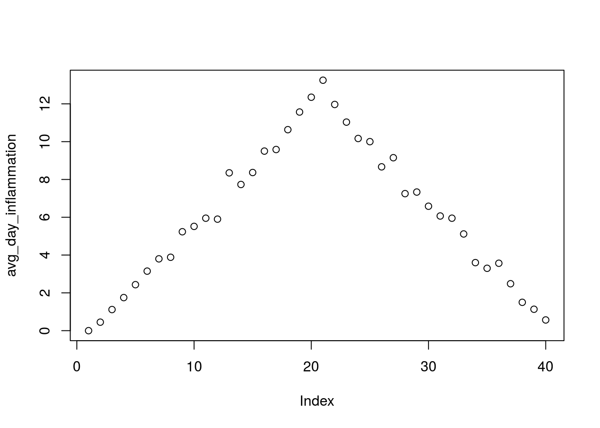

Above, we gave the function `plot` a vector of numbers corresponding to the average inflammation per day across all patients.
`plot` created a scatter plot where the y-axis is the average inflammation level and the x-axis is the order, or index, of the values in the vector, which in this case correspond to the 40 days of treatment.
The result is roughly a linear rise and fall, which is suspicious: based on other studies, we expect a sharper rise and slower fall.
Let's have a look at two other statistics: the maximum and minimum inflammation per day.


```r
max_day_inflammation <- apply(dat, 2, max)
plot(max_day_inflammation)
```


```r
min_day_inflammation <- apply(dat, 2, min)
plot(min_day_inflammation)
```


The maximum value rises and falls perfectly smoothly, while the minimum seems to be a step function. Neither result seems particularly likely, so either there's a mistake in our calculations or something is wrong with our data.

> **Plotting Data**
>
> Create a plot showing the standard deviation of the inflammation data for each day across all patients.

## Creating Functions

If we only had one data set to analyze, it would probably be faster to load the file into a spreadsheet and use that to plot some simple statistics.
But we have twelve files to check, and may have more in the future.
In this lesson, we'll learn how to write a function so that we can repeat several operations with a single command.

### Defining a Function

Let's start by defining a function `fahr_to_kelvin` that converts temperatures from Fahrenheit to Kelvin:


```r
fahr_to_kelvin <- function(temp) {
  kelvin <- ((temp - 32) * (5 / 9)) + 273.15
  return(kelvin)
}
```

We define `fahr_to_kelvin` by assigning it to the output of `function`.
The list of argument names are contained within parentheses.
Next, the [body]({{ page.root }}/reference/#function-body) of the function--the statements that are executed when it runs--is contained within curly braces (`{}`).
The statements in the body are indented by two spaces, which makes the code easier to read but does not affect how the code operates.

When we call the function, the values we pass to it are assigned to those variables so that we can use them inside the function.
Inside the function, we use a [return statement]({{ page.root }}/reference/#return-statement) to send a result back to whoever asked for it.

> **Automatic Returns**
>
> In R, it is not necessary to include the return statement.
> R automatically returns whichever variable is on the last line of the body
> of the function. Since we are just learning, we will explicitly define the
> return statement.

Let's try running our function.
Calling our own function is no different from calling any other function:


```r
# freezing point of water
fahr_to_kelvin(32)
```

```
## [1] 273.15
```

```r
# boiling point of water
fahr_to_kelvin(212)
```

```
## [1] 373.15
```

We've successfully called the function that we defined, and we have access to the value that we returned.

### Composing Functions

Now that we've seen how to turn Fahrenheit into Kelvin, it's easy to turn Kelvin into Celsius:


```r
kelvin_to_celsius <- function(temp) {
  celsius <- temp - 273.15
  return(celsius)
}

#absolute zero in Celsius
kelvin_to_celsius(0)
```

```
## [1] -273.15
```

What about converting Fahrenheit to Celsius?
We could write out the formula, but we don't need to.
Instead, we can [compose]({{ page.root }}/reference/#function-composition) the two functions we have already created:


```r
fahr_to_celsius <- function(temp) {
  temp_k <- fahr_to_kelvin(temp)
  result <- kelvin_to_celsius(temp_k)
  return(result)
}

# freezing point of water in Celsius
fahr_to_celsius(32.0)
```

```
## [1] 0
```

This is our first taste of how larger programs are built: we define basic
operations, then combine them in ever-larger chunks to get the effect we want.
Real-life functions will usually be larger than the ones shown here--typically half a dozen to a few dozen lines--but they shouldn't ever be much longer than that, or the next person who reads it won't be able to understand what's going on.

> **Chaining Functions**
>
> This example showed the output of `fahr_to_kelvin` assigned to `temp_k`, which
> is then passed to `kelvin_to_celsius` to get the final result. It is also possible
> to perform this calculation in one line of code, by "chaining" functions
> together, like so:
>
> 
> ```r
> # freezing point of water in Celsius
> kelvin_to_celsius(fahr_to_kelvin(32.0))
> ```
> 
> ```
> ## [1] 0
> ```


> **Create a Function**
>
> In the last lesson, we learned to **c**oncatenate elements into a vector using the `c` function,
> e.g. `x <- c("A", "B", "C")` creates a vector `x` with three elements.
> Furthermore, we can extend that vector again using `c`, e.g. `y <- c(x, "D")` creates a vector `y` with four elements.
> Write a function called `fence` that takes two vectors as arguments, called
> `original` and `wrapper`, and returns a new vector that has the wrapper vector
> at the beginning and end of the original:
>
> 
> ```r
> best_practice <- c("Write", "programs", "for", "people", "not", "computers")
> asterisk <- "***"  # R interprets a variable with a single value as a vector
>                    # with one element.
> fence(best_practice, asterisk)
> ```
> 
> ```
> ## [1] "***"       "Write"     "programs"  "for"       "people"    "not"      
> ## [7] "computers" "***"
> ```
>
> If the variable `v` refers to a vector, then `v[1]` is the vector's first element and `v[length(v)]` is its last (the function `length` returns the number of elements in a vector).
> Write a function called `outside` that returns a vector made up of just the first and last elements of its input:
>
> 
> ```r
> dry_principle <- c("Don't", "repeat", "yourself", "or", "others")
> outside(dry_principle)
> ```
> 
> ```
> ## [1] "Don't"  "others"
> ```


> **The Call Stack**
>
> For a deeper understanding of how functions work,
> you'll need to learn how they create their own environments and call other functions.
> Function calls are managed via the call stack.
> For more details on the call stack,
> have a look at the [supplementary material]({{ page.root }}/14-supp-call-stack/).

> **Named Variables and the Scope of Variables**
>
>  + Functions can accept arguments explicitly assigned to a variable name in
>    in the function call `functionName(variable = value)`, as well as arguments by
>    order:
> 
> ```r
> input_1 = 20
> mySum <- function(input_1, input_2 = 10) {
>   output <- input_1 + input_2
>   return(output)
> }
> ```
>
> 1.  Given the above code was run, which value does `mySum(input_1 = 1, 3)` produce?
>     1. 4
>     2. 11
>     3. 23
>     4. 30
> 2.  If `mySum(3)` returns 13, why does `mySum(input_2 = 3)` return an error?


### Testing and Documenting

Once we start putting things in functions so that we can re-use them, we need to start testing that those functions are working correctly.
To see how to do this, let's write a function to center a dataset around a particular value:


```r
center <- function(data, desired) {
  new_data <- (data - mean(data)) + desired
  return(new_data)
}
```

We could test this on our actual data, but since we don't know what the values ought to be, it will be hard to tell if the result was correct.
Instead, let's create a vector of 0s and then center that around 3.
This will make it simple to see if our function is working as expected:


```r
z <- c(0, 0, 0, 0)
z
```

```
## [1] 0 0 0 0
```

```r
center(z, 3)
```

```
## [1] 3 3 3 3
```

That looks right, so let's try center on our real data. We'll center the inflammation data from day 4 around 0:


```r
dat <- read.csv(file = "data/inflammation-01.csv", header = FALSE)
centered <- center(dat[, 4], 0)
head(centered)
```

```
## [1]  1.25 -0.75  1.25 -1.75  1.25  0.25
```

It's hard to tell from the default output whether the result is correct, but there are a few simple tests that will reassure us:


```r
# original min
min(dat[, 4])
```

```
## [1] 0
```

```r
# original mean
mean(dat[, 4])
```

```
## [1] 1.75
```

```r
# original max
max(dat[, 4])
```

```
## [1] 3
```

```r
# centered min
min(centered)
```

```
## [1] -1.75
```

```r
# centered mean
mean(centered)
```

```
## [1] 0
```

```r
# centered max
max(centered)
```

```
## [1] 1.25
```

That seems almost right: the original mean was about 1.75, so the lower bound from zero is now about -1.75.
The mean of the centered data is 0.
We can even go further and check that the standard deviation hasn't changed:


```r
# original standard deviation
sd(dat[, 4])
```

```
## [1] 1.067628
```

```r
# centered standard deviation
sd(centered)
```

```
## [1] 1.067628
```

Those values look the same, but we probably wouldn't notice if they were different in the sixth decimal place.
Let's do this instead:


```r
# difference in standard deviations before and after
sd(dat[, 4]) - sd(centered)
```

```
## [1] 0
```

Sometimes, a very small difference can be detected due to rounding at very low decimal places.
R has a useful function for comparing two objects allowing for rounding errors, `all.equal`:


```r
all.equal(sd(dat[, 4]), sd(centered))
```

```
## [1] TRUE
```

It's still possible that our function is wrong, but it seems unlikely enough that we should probably get back to doing our analysis.
We have one more task first, though: we should write some [documentation]({{ page.root }}/reference#documentation) for our function to remind ourselves later what it's for and how to use it.

A common way to put documentation in software is to add [comments]({{ page.root }}/reference/#comment) like this:


```r
center <- function(data, desired) {
  # return a new vector containing the original data centered around the
  # desired value.
  # Example: center(c(1, 2, 3), 0) => c(-1, 0, 1)
  new_data <- (data - mean(data)) + desired
  return(new_data)
}
```

> **Writing Documentation**
>
> Formal documentation for R functions is written in separate `.Rd` using a
> markup language similar to [LaTeX](http://www.latex-project.org/). You see the result of this documentation
> when you look at the help file for a given function, e.g. `?read.csv`.
> The [roxygen2](http://cran.r-project.org/web/packages/roxygen2/vignettes/rd.html) package allows R coders to write documentation alongside
> the function code and then process it into the appropriate `.Rd` files.
> You will want to switch to this more formal method of writing documentation
> when you start writing more complicated R projects.


> **Functions to Create Graphs**
>
> Write a function called `analyze` that takes a filename as a argument
> and displays the three graphs produced in the [previous lesson][01] (average, min and max inflammation over time).
> `analyze("data/inflammation-01.csv")` should produce the graphs already shown,
> while `analyze("data/inflammation-02.csv")` should produce corresponding graphs for the second data set.
> Be sure to document your function with comments.
>
<!-- > > ## Solution -->
<!-- > > ~~~ -->
<!-- > > analyze <- function(filename) { -->
<!-- > >   # Plots the average, min, and max inflammation over time. -->
<!-- > >   # Input is character string of a csv file. -->
<!-- > >   dat <- read.csv(file = filename, header = FALSE) -->
<!-- > >   avg_day_inflammation <- apply(dat, 2, mean) -->
<!-- > >   plot(avg_day_inflammation) -->
<!-- > >   max_day_inflammation <- apply(dat, 2, max) -->
<!-- > >   plot(max_day_inflammation) -->
<!-- > >   min_day_inflammation <- apply(dat, 2, min) -->
<!-- > >   plot(min_day_inflammation) -->
<!-- > > } -->
<!-- > > ~~~ -->

> **Rescaling**
>
> Write a function `rescale` that takes a vector as input and returns a corresponding vector of values scaled to lie in the range 0 to 1.
> (If $L$ and $H$ are the lowest and highest values in the original vector, then the replacement for a value $v$ should be $(v-L) / (H-L)$.)
> Be sure to document your function with comments.
>
> Test that your `rescale` function is working properly using `min`, `max`, and `plot`.
>
<!-- > > ## Solution -->
<!-- > > ~~~ -->
<!-- > > rescale <- function(v) { -->
<!-- > >   # Rescales a vector, v, to lie in the range 0 to 1. -->
<!-- > >   L <- min(v) -->
<!-- > >   H <- max(v) -->
<!-- > >   result <- (v - L) / (H - L) -->
<!-- > >   return(result) -->
<!-- > > } -->
<!-- > > ~~~ -->


### Defining Defaults

We have passed arguments to functions in two ways: directly, as in `dim(dat)`, and by name, as in `read.csv(file = "data/inflammation-01.csv", header = FALSE)`.
In fact, we can pass the arguments to `read.csv` without naming them:


```r
dat <- read.csv("data/inflammation-01.csv", FALSE)
```

However, the position of the arguments matters if they are not named.


```r
dat <- read.csv(header = FALSE, file = "data/inflammation-01.csv")
dat <- read.csv(FALSE, "data/inflammation-01.csv")
```

```
## Error in read.table(file = file, header = header, sep = sep, quote = quote, : 'file' must be a character string or connection
```

To understand what's going on, and make our own functions easier to use, let's re-define our `center` function like this:


```r
center <- function(data, desired = 0) {
  # return a new vector containing the original data centered around the
  # desired value (0 by default).
  # Example: center(c(1, 2, 3), 0) => c(-1, 0, 1)
  new_data <- (data - mean(data)) + desired
  return(new_data)
}
```

The key change is that the second argument is now written `desired = 0` instead of just `desired`.
If we call the function with two arguments, it works as it did before:


```r
test_data <- c(0, 0, 0, 0)
center(test_data, 3)
```

```
## [1] 3 3 3 3
```

But we can also now call `center()` with just one argument, in which case `desired` is automatically assigned the default value of `0`:


```r
more_data <- 5 + test_data
more_data
```

```
## [1] 5 5 5 5
```

```r
center(more_data)
```

```
## [1] 0 0 0 0
```

This is handy: if we usually want a function to work one way, but occasionally need it to do something else, we can allow people to pass an argument when they need to but provide a default to make the normal case easier.

The example below shows how R matches values to arguments


```r
display <- function(a = 1, b = 2, c = 3) {
  result <- c(a, b, c)
  names(result) <- c("a", "b", "c")  # This names each element of the vector
  return(result)
}

# no arguments
display()
```

```
## a b c 
## 1 2 3
```

```r
# one argument
display(55)
```

```
##  a  b  c 
## 55  2  3
```

```r
# two arguments
display(55, 66)
```

```
##  a  b  c 
## 55 66  3
```

```r
# three arguments
display (55, 66, 77)
```

```
##  a  b  c 
## 55 66 77
```

As this example shows, arguments are matched from left to right, and any that haven't been given a value explicitly get their default value.
We can override this behavior by naming the value as we pass it in:


```r
# only setting the value of c
display(c = 77)
```

```
##  a  b  c 
##  1  2 77
```

> **Matching Arguments**
>
> To be precise, R has three ways that arguments are supplied
> by you are matched to the *formal arguments* of the function definition:
>
> 1. by complete name,
> 2. by partial name (matching on initial *n* characters of the argument name), and
> 3. by position.
>
> Arguments are matched in the manner outlined above in *that order*: by
> complete name, then by partial matching of names, and finally by position.
{: .callout}

With that in hand, let's look at the help for `read.csv()`:


```r
?read.csv
```

There's a lot of information there, but the most important part is the first couple of lines:


```r
read.csv(file, header = TRUE, sep = ",", quote = "\"",
         dec = ".", fill = TRUE, comment.char = "", ...)
```

This tells us that `read.csv()` has one argument, `file`, that doesn't have a default value, and six others that do.
Now we understand why the following gives an error:


```r
dat <- read.csv(FALSE, "data/inflammation-01.csv")
```

```
## Error in read.table(file = file, header = header, sep = sep, quote = quote, : 'file' must be a character string or connection
```

It fails because `FALSE` is assigned to `file` and the filename is assigned to the argument `header`.

> **A Function with Default Argument Values**
>
> Rewrite the `rescale` function so that it scales a vector to lie between 0 and 1 by default, but will allow the caller to specify lower and upper bounds if they want.
> Compare your implementation to your neighbor's: do the two functions always behave the same way?
>
<!-- > > ## Solution -->
<!-- > > ~~~ -->
<!-- > > rescale <- function(v, lower = 0, upper = 1) { -->
<!-- > >   # Rescales a vector, v, to lie in the range lower to upper. -->
<!-- > >   L <- min(v) -->
<!-- > >   H <- max(v) -->
<!-- > >   result <- (v - L) / (H - L) * (upper - lower) + lower -->
<!-- > >   return(result) -->
<!-- > > } -->
<!-- > > ~~~ -->


## Loops in R

We have created a function called `analyze` that creates graphs of the minimum, average, and maximum daily inflammation rates for a single data set:


```r
analyze <- function(filename) {
  # Plots the average, min, and max inflammation over time.
  # Input is character string of a csv file.
  dat <- read.csv(file = filename, header = FALSE)
  avg_day_inflammation <- apply(dat, 2, mean)
  plot(avg_day_inflammation)
  max_day_inflammation <- apply(dat, 2, max)
  plot(max_day_inflammation)
  min_day_inflammation <- apply(dat, 2, min)
  plot(min_day_inflammation)
}

analyze("data/inflammation-01.csv")
```

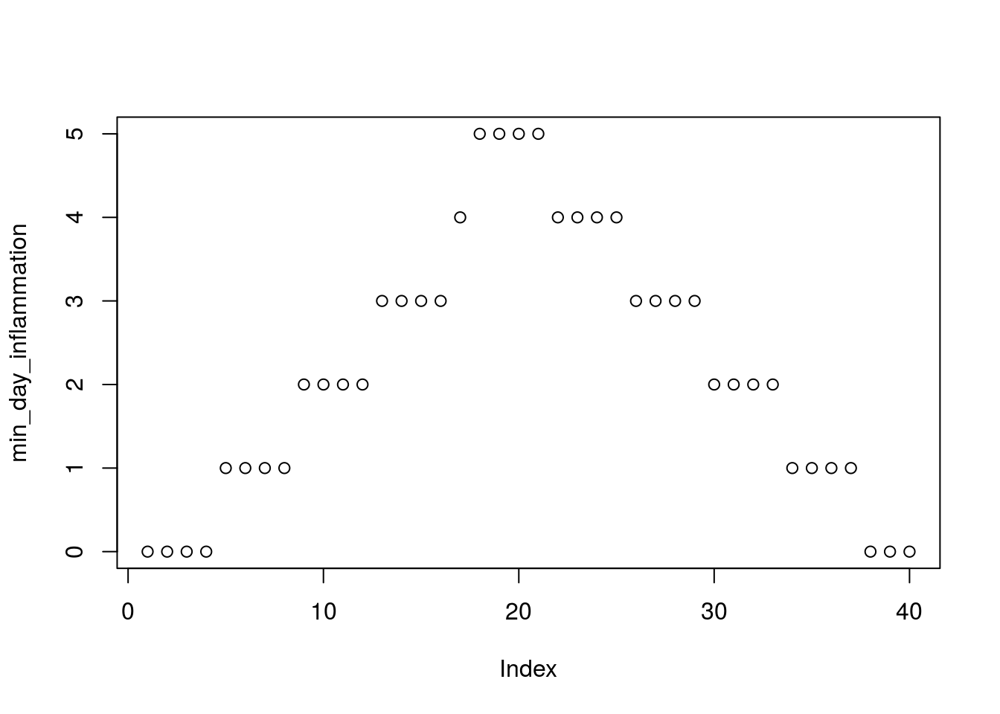

We can use it to analyze other data sets one by one:


```r
analyze("data/inflammation-02.csv")
```

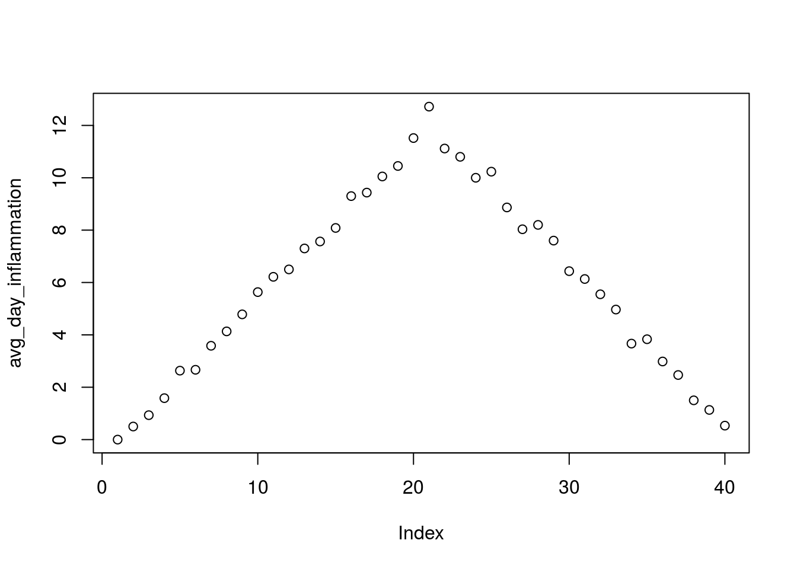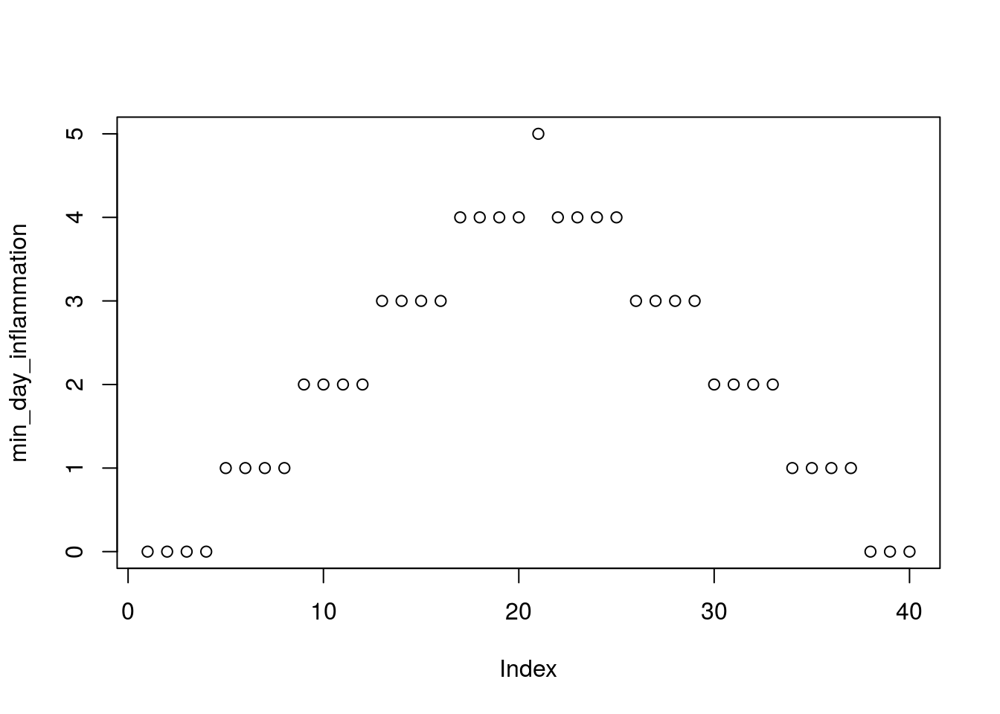

but we have a dozen data sets right now and more on the way.
We want to create plots for all our data sets with a single statement.
To do that, we'll have to teach the computer how to repeat things.

### For Loops

Suppose we want to print each word in a sentence.
One way is to use six `print` statements:


```r
best_practice <- c("Let", "the", "computer", "do", "the", "work")
print_words <- function(sentence) {
  print(sentence[1])
  print(sentence[2])
  print(sentence[3])
  print(sentence[4])
  print(sentence[5])
  print(sentence[6])
}

print_words(best_practice)
```

```
## [1] "Let"
## [1] "the"
## [1] "computer"
## [1] "do"
## [1] "the"
## [1] "work"
```

but that's a bad approach for two reasons:

 1. It doesn't scale: if we want to print the elements in a vector that's hundreds long, we'd be better off just typing them in.

 2. It's fragile: if we give it a longer vector, it only prints part of the data, and if we give it a shorter input, it returns `NA` values because we're asking for elements that don't exist!


```r
best_practice[-6]
```

```
## [1] "Let"      "the"      "computer" "do"       "the"
```

```r
print_words(best_practice[-6])
```

```
## [1] "Let"
## [1] "the"
## [1] "computer"
## [1] "do"
## [1] "the"
## [1] NA
```

> **Not Available**
>
> R has has a special variable, `NA`, for designating missing values that are
> **N**ot **A**vailable in a data set. See `?NA` and [An Introduction to R][na]
> for more details.
{: .callout}

[na]: http://cran.r-project.org/doc/manuals/r-release/R-intro.html#Missing-values

Here's a better approach:


```r
print_words <- function(sentence) {
  for (word in sentence) {
    print(word)
  }
}

print_words(best_practice)
```

```
## [1] "Let"
## [1] "the"
## [1] "computer"
## [1] "do"
## [1] "the"
## [1] "work"
```

This is shorter---certainly shorter than something that prints every character in a hundred-letter string---and more robust as well:


```r
print_words(best_practice[-6])
```

```
## [1] "Let"
## [1] "the"
## [1] "computer"
## [1] "do"
## [1] "the"
```

The improved version of `print_words` uses a [for loop]({{ page.root }}/reference/#for-loop) to repeat an operation---in this case, printing---once for each thing in a collection.
The general form of a loop is:


```r
for (variable in collection) {
  do things with variable
}
```

We can name the [loop variable]({{ page.root }}/reference/#loop-variable) anything we like (with a few [restrictions][], e.g. the name of the variable cannot start with a digit).
`in` is part of the `for` syntax.
Note that the body of the loop is enclosed in curly braces `{ }`.
For a single-line loop body, as here, the braces aren't needed, but it is good practice to include them as we did.

[restrictions]: http://cran.r-project.org/doc/manuals/R-intro.html#R-commands_003b-case-sensitivity-etc

Here's another loop that repeatedly updates a variable:


```r
len <- 0
vowels <- c("a", "e", "i", "o", "u")
for (v in vowels) {
  len <- len + 1
}
# Number of vowels
len
```

```
## [1] 5
```

It's worth tracing the execution of this little program step by step.
Since there are five elements in the vector `vowels`, the statement inside the loop will be executed five times.
The first time around, `len` is zero (the value assigned to it on line 1) and `v` is `"a"`.
The statement adds 1 to the old value of `len`, producing 1, and updates `len` to refer to that new value.
The next time around, `v` is `"e"` and `len` is 1, so `len` is updated to be 2.
After three more updates, `len` is 5; since there is nothing left in the vector `vowels` for R to process, the loop finishes.

Note that a loop variable is just a variable that's being used to record progress in a loop.
It still exists after the loop is over, and we can re-use variables previously defined as loop variables as well:


```r
letter <- "z"
for (letter in c("a", "b", "c")) {
  print(letter)
}
```

```
## [1] "a"
## [1] "b"
## [1] "c"
```

```r
# after the loop, letter is
letter
```

```
## [1] "c"
```

Note also that finding the length of a vector is such a common operation that R actually has a built-in function to do it called `length`:


```r
length(vowels)
```

```
## [1] 5
```

`length` is much faster than any R function we could write ourselves, and much easier to read than a two-line loop; it will also give us the length of many other things that we haven't met yet, so we should always use it when we can (see this [lesson]({{ page.root }}/13-supp-data-structures/) to learn more about the different ways to store data in R).


> **Printing Numbers**
>
> R has a built-in function called `seq` that creates a list of numbers:
>
> 
> ```r
> seq(3)
> ```
> 
> ```
> ## [1] 1 2 3
> ```
>
> Using `seq`, write a function that prints the first **N** natural numbers, one per line:
>
> 
> ```r
> print_N(3)
> ```
> 
> ```
> ## [1] 1
> ## [1] 2
> ## [1] 3
> ```
>
<!-- > > ## Solution -->
<!-- > > ~~~ -->
<!-- > > print_N <- function(N) { -->
<!-- > >   nseq <- seq(N) -->
<!-- > >   for (num in nseq) { -->
<!-- > >     print(num) -->
<!-- > >   } -->
<!-- > > } -->
<!-- > > ~~~ -->

> **Summing Values**
>
> Write a function called `total` that calculates the sum of the values in a vector.
> (R has a built-in function called `sum` that does this for you.
> Please don't use it for this exercise.)
>
> 
> ```r
> ex_vec <- c(4, 8, 15, 16, 23, 42)
> total(ex_vec)
> ```
> 
> ```
> ## [1] 108
> ```
>
<!-- > > ## Solution -->
<!-- > > ~~~ -->
<!-- > > total <- function(vec) { -->
<!-- > >   #calculates the sum of the values in a vector -->
<!-- > >   vec_sum <- 0 -->
<!-- > >   for (num in vec) { -->
<!-- > >     vec_sum <- vec_sum + num -->
<!-- > >   } -->
<!-- > >   return(vec_sum) -->
<!-- > > } -->
<!-- > > ~~~ -->

> **Exponentiation**
>
> Exponentiation is built into R:
>
> 
> ```r
> 2^4
> ```
> 
> ```
> ## [1] 16
> ```
>
> Write a function called `expo` that uses a loop to calculate the same result.
>
> 
> ```r
> expo(2, 4)
> ```
> 
> ```
> ## [1] 16
> ```
>
<!-- > > ## Solution -->
<!-- > > ~~~ -->
<!-- > > expo <- function(base, power) { -->
<!-- > >   result <- 1 -->
<!-- > >   for (i in seq(power)) { -->
<!-- > >     result <- result * base -->
<!-- > >   } -->
<!-- > >   return(result) -->
<!-- > > } -->
<!-- > > ~~~ -->

### Processing Multiple Files

We now have almost everything we need to process all our data files.
The only thing that's missing is a function that finds files whose names match a pattern.
We do not need to write it ourselves because R already has a function to do this called `list.files`.

If we run the function without any arguments, `list.files()`, it returns every file in the current working directory.
We can understand this result by reading the help file (`?list.files`).
The first argument, `path`, is the path to the directory to be searched, and it has the default value of `"."`
(recall from the [lesson]({{ site.swc_pages }}/shell-novice/01-filedir/) on the Unix Shell that `"."` is shorthand for the current working directory).
The second argument, `pattern`, is the pattern being searched, and it has the default value of `NULL`.
Since no pattern is specified to filter the files, all files are returned.

So to list all the csv files, we could run either of the following:


```r
list.files(path = "data", pattern = "csv")
```

```
##  [1] "car-speeds-cleaned.csv" "car-speeds.csv"        
##  [3] "heights.csv"            "inflammation-01.csv"   
##  [5] "inflammation-02.csv"    "inflammation-03.csv"   
##  [7] "inflammation-04.csv"    "inflammation-05.csv"   
##  [9] "inflammation-06.csv"    "inflammation-07.csv"   
## [11] "inflammation-08.csv"    "inflammation-09.csv"   
## [13] "inflammation-10.csv"    "inflammation-11.csv"   
## [15] "inflammation-12.csv"    "sample.csv"            
## [17] "small-01.csv"           "small-02.csv"          
## [19] "small-03.csv"
```

```r
list.files(path = "data", pattern = "inflammation")
```

```
##  [1] "inflammation-01.csv" "inflammation-02.csv" "inflammation-03.csv"
##  [4] "inflammation-04.csv" "inflammation-05.csv" "inflammation-06.csv"
##  [7] "inflammation-07.csv" "inflammation-08.csv" "inflammation-09.csv"
## [10] "inflammation-10.csv" "inflammation-11.csv" "inflammation-12.csv"
```

> **Organizing Larger Projects**
>
> For larger projects, it is recommended to organize separate parts of the
> analysis into multiple subdirectories, e.g. one subdirectory for the raw data,
> one for the code, and one for the results like figures. We have done that here
> to some extent, putting all of our data files into the subdirectory "data".
> For more advice on this topic, you can read [A quick guide to organizing
> computational biology projects][Noble2009] by William Stafford Noble.

[Noble2009]: http://www.ploscompbiol.org/article/info%3Adoi%2F10.1371%2Fjournal.pcbi.1000424


As these examples show, `list.files` result is a vector of strings, which means we can loop over it to do something with each filename in turn.
In our case, the "something" we want is our `analyze` function.

Because we have put our data in separate subdirectory, if we want to access these files
using the output of `list.files` we also need to include the "path" portion of the file name.
We can do that by using the argument `full.names = TRUE`.


```r
list.files(path = "data", pattern = "csv", full.names = TRUE)
```

```
##  [1] "data/car-speeds-cleaned.csv" "data/car-speeds.csv"        
##  [3] "data/heights.csv"            "data/inflammation-01.csv"   
##  [5] "data/inflammation-02.csv"    "data/inflammation-03.csv"   
##  [7] "data/inflammation-04.csv"    "data/inflammation-05.csv"   
##  [9] "data/inflammation-06.csv"    "data/inflammation-07.csv"   
## [11] "data/inflammation-08.csv"    "data/inflammation-09.csv"   
## [13] "data/inflammation-10.csv"    "data/inflammation-11.csv"   
## [15] "data/inflammation-12.csv"    "data/sample.csv"            
## [17] "data/small-01.csv"           "data/small-02.csv"          
## [19] "data/small-03.csv"
```

```r
list.files(path = "data", pattern = "inflammation", full.names = TRUE)
```

```
##  [1] "data/inflammation-01.csv" "data/inflammation-02.csv"
##  [3] "data/inflammation-03.csv" "data/inflammation-04.csv"
##  [5] "data/inflammation-05.csv" "data/inflammation-06.csv"
##  [7] "data/inflammation-07.csv" "data/inflammation-08.csv"
##  [9] "data/inflammation-09.csv" "data/inflammation-10.csv"
## [11] "data/inflammation-11.csv" "data/inflammation-12.csv"
```


Let's test out running our `analyze` function by using it on the first three files in the vector returned by `list.files`:


```r
filenames <- list.files(path = "data", pattern = "inflammation.*csv", full.names = TRUE)
filenames <- filenames[1:3]
for (f in filenames) {
  print(f)
  analyze(f)
}
```

```
## [1] "data/inflammation-01.csv"
```


```
## [1] "data/inflammation-02.csv"
```

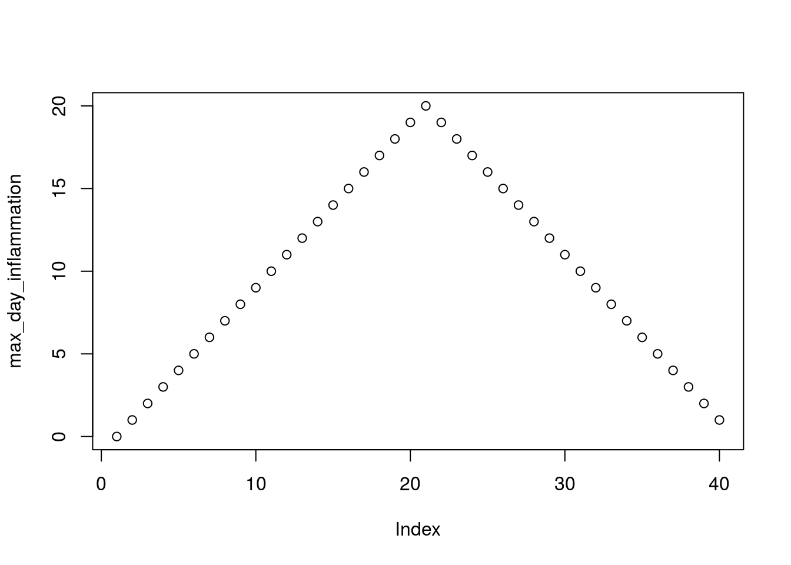

```
## [1] "data/inflammation-03.csv"
```

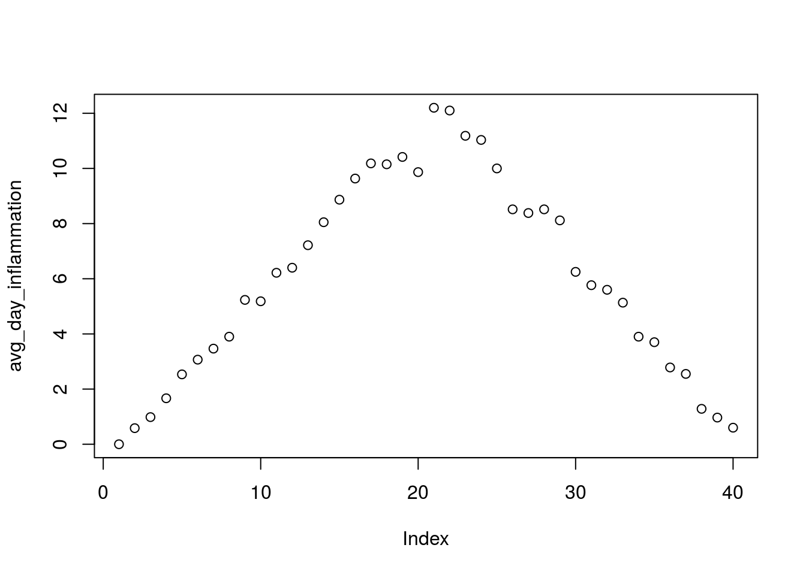

Sure enough, the maxima of these data sets show exactly the same ramp as the first, and their minima show the same staircase structure.

> **Other Ways to Do It**
>
> In this lesson we saw how to use a simple `for` loop to repeat an operation.
> As you progress with R, you will learn that there are multiple ways to
> accomplish this. Sometimes the choice of one method over another is more a
> matter of personal style, but other times it can have consequences for the
> speed of your code. For instruction on best practices, see 
> [Best Practice for Repetition] below that demonstrates how to properly repeat
> operations in R.

> **Using Loops to Analyze Multiple Files**
>
> Write a function called `analyze_all` that takes a filename pattern as its sole argument
> and runs `analyze` for each file whose name matches the pattern.
>
<!-- > > ## Solution -->
<!-- > > ~~~ -->
<!-- > > analyze_all <- function(pattern) { -->
<!-- > >   # Runs the function analyze for each file in the current working directory -->
<!-- > >   # that contains the given pattern. -->
<!-- > >   filenames <- list.files(path = "data", pattern = pattern, full.names = TRUE) -->
<!-- > >   for (f in filenames) { -->
<!-- > >     analyze(f) -->
<!-- > >   } -->
<!-- > > } -->
<!-- > > ~~~ -->

## Best Practice for Repetition

In R you have multiple options when repeating calculations: vectorized operations, `for` loops, and `apply` functions.

### Vectorized Operations

A key difference between R and many other languages is a topic known as vectorization.
When you wrote the `total` function, we mentioned that R already has `sum` to do this; `sum` is *much* faster than the interpreted `for` loop because `sum` is coded in C to work with a vector of numbers.
Many of R's functions work this way; the loop is hidden from you in C.
Learning to use vectorized operations is a key skill in R.

For example, to add pairs of numbers contained in two vectors


```r
a <- 1:10
b <- 1:10
```

You could loop over the pairs adding each in turn, but that would be very inefficient in R.

Instead of using `i in a` to make our loop variable, we use the function `seq_along` to generate indices for each element `a` contains.


```r
res <- numeric(length = length(a))
for (i in seq_along(a)) {
  res[i] <- a[i] + b[i]
}
res
```

```
##  [1]  2  4  6  8 10 12 14 16 18 20
```

Instead, `+` is a *vectorized* function which can operate on entire vectors at once


```r
res2 <- a + b
all.equal(res, res2)
```

```
## [1] TRUE
```

### Vector Recycling

When performing vector operations in R, it is important to know about recycling. If you perform an operation on two or more vectors of unequal length, R will recycle elements of the shorter vector(s) to match the longest vector.  For example:


```r
a <- 1:10
b <- 1:5
a + b
```

```
##  [1]  2  4  6  8 10  7  9 11 13 15
```

The elements of `a` and `b` are added together starting from the first element of both vectors. When R reaches the end of the shorter vector `b`, it starts again at the first element of `b` and continues until it reaches the last element of the longest vector `a`.  This behaviour may seem crazy at first glance, but it is very useful when you want to perform the same operation on every element of a vector. For example, say we want to multiply every element of our vector `a` by 5:


```r
a <- 1:10
b <- 5
a * b
```

```
##  [1]  5 10 15 20 25 30 35 40 45 50
```

Remember there are no scalars in R, so `b` is actually a vector of length 1; in order to add its value to every element of `a`, it is *recycled* to match the length of `a`.

When the length of the longer object is a multiple of the shorter object length (as in our example above), the recycling occurs silently. When the longer object length is not a multiple of the shorter object length, a warning is given:


```r
a <- 1:10
b <- 1:7
a + b
```

```
## Warning in a + b: longer object length is not a multiple of shorter object
## length
```

```
##  [1]  2  4  6  8 10 12 14  9 11 13
```

### `for` or `apply`?

A `for` loop is used to apply the same function calls to a collection of objects.
R has a family of functions, the `apply` family, which can be used in much the same way.
You've already used one of the family, `apply` in the first [lesson]({{ page.root }}/01-starting-with-data/).
The `apply` family members include

 * `apply`  - apply over the margins of an array (e.g. the rows or columns of a matrix)
 * `lapply` - apply over an object and return list
 * `sapply` - apply over an object and return a simplified object (an array) if possible
 * `vapply` - similar to `sapply` but you specify the type of object returned by the iterations

Each of these has an argument `FUN` which takes a function to apply to each element of the object.
Instead of looping over `filenames` and calling `analyze`, as you did earlier, you could `sapply` over `filenames` with `FUN = analyze`:


```r
sapply(filenames, FUN = analyze)
```

Deciding whether to use `for` or one of the `apply` family is really personal preference.
Using an `apply` family function forces to you encapsulate your operations as a function rather than separate calls with `for`.
`for` loops are often more natural in some circumstances; for several related operations, a `for` loop will avoid you having to pass in a lot of extra arguments to your function.

### Loops in R Are Slow

No, they are not! *If* you follow some golden rules:

 1. Don't use a loop when a vectorized alternative exists
 2. Don't grow objects (via `c`, `cbind`, etc) during the loop - R has to create a new object and copy across the information just to add a new element or row/column
 3. Allocate an object to hold the results and fill it in during the loop

As an example, we'll create a new version of `analyze` that will return the mean inflammation per day (column) of each file.


```r
analyze2 <- function(filenames) {
  for (f in seq_along(filenames)) {
    fdata <- read.csv(filenames[f], header = FALSE)
    res <- apply(fdata, 2, mean)
    if (f == 1) {
      out <- res
    } else {
      # The loop is slowed by this call to cbind that grows the object
      out <- cbind(out, res)
    }
  }
  return(out)
}

system.time(avg2 <- analyze2(filenames))
```

```
##    user  system elapsed 
##    0.01    0.00    0.01
```

Note how we add a new column to `out` at each iteration?
This is a cardinal sin of writing a `for` loop in R.

Instead, we can create an empty matrix with the right dimensions (rows/columns) to hold the results.
Then we loop over the files but this time we fill in the `f`th column of our results matrix `out`.
This time there is no copying/growing for R to deal with.


```r
analyze3 <- function(filenames) {
  out <- matrix(ncol = length(filenames), nrow = 40) ## assuming 40 here from files
  for (f in seq_along(filenames)) {
    fdata <- read.csv(filenames[f], header = FALSE)
    out[, f] <- apply(fdata, 2, mean)
  }
  return(out)
}

system.time(avg3 <- analyze3(filenames))
```

```
##    user  system elapsed 
##    0.01    0.00    0.01
```

In this simple example there is little difference in the compute time of `analyze2` and `analyze3`.
This is because we are only iterating over 12 files and hence we only incur 12 copy/grow operations.
If we were doing this over more files or the data objects we were growing were larger, the penalty for copying/growing would be much larger.

Note that `apply` handles these memory allocation issues for you, but then you have to write the loop part as a function to pass to `apply`.
At its heart, `apply` is just a `for` loop with extra convenience.

## Make Choices

Our previous lessons have shown us how to manipulate data, define our own functions, and repeat things.
However, the programs we have written so far always do the same things, regardless of what data they're given.
We want programs to make choices based on the values they are manipulating.

### Saving Plots to a File

So far, we have built a function `analyze` to plot summary statistics of the inflammation data:


```r
analyze <- function(filename) {
  # Plots the average, min, and max inflammation over time.
  # Input is character string of a csv file.
  dat <- read.csv(file = filename, header = FALSE)
  avg_day_inflammation <- apply(dat, 2, mean)
  plot(avg_day_inflammation)
  max_day_inflammation <- apply(dat, 2, max)
  plot(max_day_inflammation)
  min_day_inflammation <- apply(dat, 2, min)
  plot(min_day_inflammation)
}
```

And also built the function `analyze_all` to automate the processing of each data file:


```r
analyze_all <- function(pattern) {
  # Runs the function analyze for each file in the current working directory
  # that contains the given pattern.
  filenames <- list.files(path = "data", pattern = pattern, full.names = TRUE)
  for (f in filenames) {
    analyze(f)
  }
}
```

While these are useful in an interactive R session, what if we want to send our results to our collaborators?
Since we currently have 12 data sets, running `analyze_all` creates 36 plots.
Saving each of these individually would be tedious and error-prone.
And in the likely situation that we want to change how the data is processed or the look of the plots, we would have to once again save all 36 before sharing the updated results with our collaborators.

Here's how we can save all three plots of the first inflammation data set in a pdf file:


```r
pdf("results/inflammation-01.pdf")
analyze("data/inflammation-01.csv")
dev.off()
```

The function `pdf` redirects all the plots generated by R into a pdf file, which in this case we have named "inflammation-01.pdf".
After we are done generating the plots to be saved in the pdf file, we stop R from redirecting plots with the function `dev.off`.

> **Overwriting Plots**
>
> If you run `pdf` multiple times without running `dev.off`, you will save plots to the most recently opened file.
> However, you won't be able to open the previous pdf files because the connections were not closed.
> In order to get out of this situation, you'll need to run `dev.off` until all the pdf connections are closed.
> You can check your current status using the function `dev.cur`.
> If it says "pdf", all your plots are being saved in the last pdf specified.
> If it says "null device" or "RStudioGD", the plots will be visualized normally.


We can update the `analyze` function so that it always saves the plots in a pdf.
But that would make it more difficult to interactively test out new changes.
It would be ideal if `analyze` would either save or not save the plots based on its input.

### Conditionals

In order to update our function to decide between saving or not, we need to write code that automatically decides between multiple options.
The tool R gives us for doing this is called a [conditional statement]({{ page.root }}/reference/#conditional-statement), and looks like this:


```r
num <- 37
if (num > 100) {
  print("greater")
} else {
  print("not greater")
}
print("done")
```

```
## [1] "not greater"
## [1] "done"
```

The second line of this code uses an `if` statement to tell R that we want to make a choice.
If the following test is true, the body of the `if` (i.e., the lines in the curly braces underneath it) are executed.
If the test is false, the body of the `else` is executed instead.
Only one or the other is ever executed:


```r
knitr::include_graphics("fig/python-flowchart-conditional.svg")
```


In the example above, the test `num > 100` returns the value `FALSE`, which is why the code inside the `if` block was skipped and the code inside the `else` statement was run instead.


```r
num > 100
```

```
## [1] FALSE
```

And as you likely guessed, the opposite of `FALSE` is `TRUE`.


```r
num < 100
```

```
## [1] TRUE
```

Conditional statements don't have to include an `else`.
If there isn't one, R simply does nothing if the test is false:


```r
num <- 53
if (num > 100) {
  print("num is greater than 100")
}
```

We can also chain several tests together when there are more than two options.
This makes it simple to write a function that returns the sign of a number:


```r
sign <- function(num) {
  if (num > 0) {
    return(1)
  } else if (num == 0) {
    return(0)
  } else {
    return(-1)
  }
}

sign(-3)
```

```
## [1] -1
```

```r
sign(0)
```

```
## [1] 0
```

```r
sign(2/3)
```

```
## [1] 1
```

Note that when combining `else` and `if` in an `else if` statement (similar to `elif` in Python), the `if` portion still requires a direct input condition.  This is never the case for the `else` statement alone, which is only executed if all other conditions go unsatisfied.
Note that the test for equality uses two equal signs, `==`.

> **Other Comparisons**
>
> Other tests include greater than or equal to (`>=`), less than or equal to
> (`<=`), and not equal to (`!=`).
{: .callout}

We can also combine tests.
An ampersand, `&`, symbolizes "and".
A vertical bar, `|`, symbolizes "or".
`&` is only true if both parts are true:


```r
if (1 > 0 & -1 > 0) {
    print("both parts are true")
} else {
  print("at least one part is not true")
}
```

```
## [1] "at least one part is not true"
```

while `|` is true if either part is true:


```r
if (1 > 0 | -1 > 0) {
    print("at least one part is true")
} else {
  print("neither part is true")
}
```

```
## [1] "at least one part is true"
```

In this case, "either" means "either or both", not "either one or the other but not both".

> **Choosing Plots Based on Data**
>
> Write a function `plot_dist` that plots
> a boxplot if the length of the vector is greater than a specified threshold
> and a stripchart otherwise.
> To do this you'll use the R functions `boxplot` and `stripchart`.
>
>
>```r
> dat <- read.csv("data/inflammation-01.csv", header = FALSE)
> plot_dist(dat[, 10], threshold = 10)     # day (column) 10
>```
>
>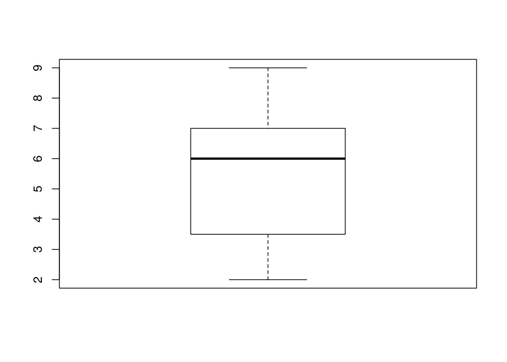
>
>```r
> plot_dist(dat[1:5, 10], threshold = 10)  # samples (rows) 1-5 on day (column) 10
>```
>
>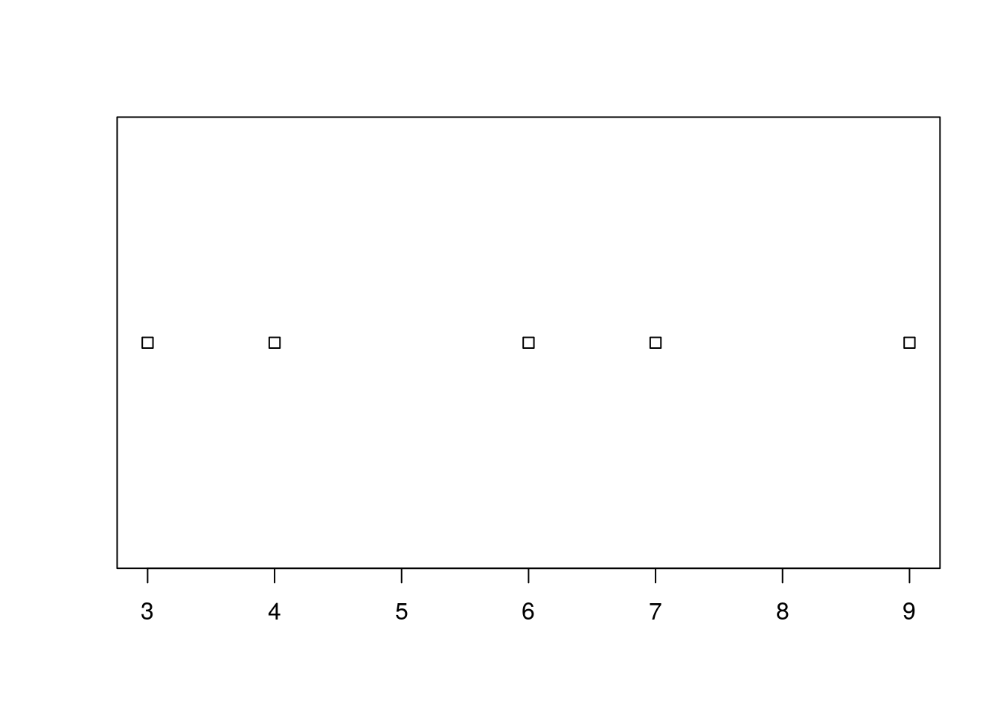
>
<!-- > > ## Solution -->
<!-- > > ~~~ -->
<!-- > > plot_dist <- function(x, threshold) { -->
<!-- > >   if (length(x) > threshold) { -->
<!-- > >     boxplot(x) -->
<!-- > >   } else { -->
<!-- > >     stripchart(x) -->
<!-- > >   } -->
<!-- > > } -->
<!-- > > ~~~ -->

> **Histograms Instead**
>
> One of your collaborators prefers to see the distributions of the larger vectors
> as a histogram instead of as a boxplot.
> In order to choose between a histogram and a boxplot
> we will edit the function `plot_dist` and add an additional argument `use_boxplot`.
> By default we will set `use_boxplot` to `TRUE`
> which will create a boxplot when the vector is longer than `threshold`.
> When `use_boxplot` is set to `FALSE`,
> `plot_dist` will instead plot a histogram for the larger vectors.
> As before, if the length of the vector is shorter than `threshold`,
> `plot_dist` will create a stripchart.
> A histogram is made with the `hist` command in R.
>
> 
> ```r
> dat <- read.csv("data/inflammation-01.csv", header = FALSE)
> plot_dist(dat[, 10], threshold = 10, use_boxplot = TRUE)   # day (column) 10 - create boxplot
> ```
> 
> 
> 
> ```r
> plot_dist(dat[, 10], threshold = 10, use_boxplot = FALSE)  # day (column) 10 - create histogram
> ```
> 
> 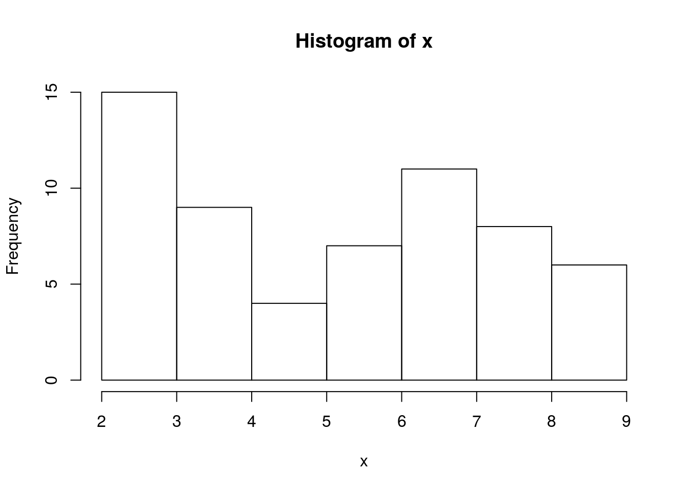
> 
> ```r
> plot_dist(dat[1:5, 10], threshold = 10)                    # samples (rows) 1-5 on day (column) 10
> ```
> 
> 
>
<!-- > > ## Solution -->
<!-- > > ~~~ -->
<!-- > > plot_dist <- function(x, threshold, use_boxplot = TRUE) { -->
<!-- > >    if (length(x) > threshold & use_boxplot) { -->
<!-- > >        boxplot(x) -->
<!-- > >    } else if (length(x) > threshold & !use_boxplot) { -->
<!-- > >        hist(x) -->
<!-- > >    } else { -->
<!-- > >        stripchart(x) -->
<!-- > >    } -->
<!-- > > } -->
<!-- > > ~~~ -->

> **Find the Maximum Inflammation Score**
>
> Find the file containing the patient with the highest average inflammation score.
> Print the file name, the patient number (row number) and the value of the maximum average inflammation score.
>
> Tips:
>
> 1. Use variables to store the maximum average and update it as you go through files and patients.
> 1. You can use nested loops (one loop is inside the other) to go through the files as well as through the patients in each file (every row).
>
> Complete the code below:
>
> 
> ```r
> filenames <- list.files(path = "data", pattern = "inflammation.*csv", full.names = TRUE)
> filename_max <- "" # filename where the maximum average inflammation patient is found
> patient_max <- 0 # index (row number) for this patient in this file
> average_inf_max <- 0 # value of the average inflammation score for this patient
> for (f in filenames) {
>   dat <- read.csv(file = f, header = FALSE)
>   dat.means = apply(dat, 1, mean)
>   for (patient_index in length(dat.means)){
>     patient_average_inf = dat.means[patient_index]
>     # Add your code here ...
>   }
> }
> print(filename_max)
> print(patient_max)
> print(average_inf_max)
> ```
>
<!-- > > ## Solution -->
<!-- > > ~~~ -->
<!-- > > # Add your code here ... -->
<!-- > > if (patient_average_inf > average_inf_max) { -->
<!-- > >   average_inf_max = patient_average_inf -->
<!-- > >   filename_max <- f -->
<!-- > >   patient_max <- patient_index -->
<!-- > > } -->
<!-- > > ~~~ -->


### Saving Automatically Generated Figures

Now that we know how to have R make decisions based on input values,
let's update `analyze`:


```r
analyze <- function(filename, output = NULL) {
  # Plots the average, min, and max inflammation over time.
  # Input:
  #    filename: character string of a csv file
  #    output: character string of pdf file for saving
  if (!is.null(output)) {
    pdf(output)
  }
  dat <- read.csv(file = filename, header = FALSE)
  avg_day_inflammation <- apply(dat, 2, mean)
  plot(avg_day_inflammation)
  max_day_inflammation <- apply(dat, 2, max)
  plot(max_day_inflammation)
  min_day_inflammation <- apply(dat, 2, min)
  plot(min_day_inflammation)
  if (!is.null(output)) {
    dev.off()
  }
}
```

We added an argument, `output`, that by default is set to `NULL`.
An `if` statement at the beginning checks the argument `output` to decide whether or not to save the plots to a pdf.
Let's break it down.
The function `is.null` returns `TRUE` if a variable is `NULL` and `FALSE` otherwise.
The exclamation mark, `!`, stands for "not".
Therefore the line in the `if` block is only executed if `output` is "not null".


```r
output <- NULL
is.null(output)
```

```
## [1] TRUE
```

```r
!is.null(output)
```

```
## [1] FALSE
```

Now we can use `analyze` interactively, as before,


```r
analyze("data/inflammation-01.csv")
```


but also use it to save plots,


```r
analyze("data/inflammation-01.csv", output = "results/inflammation-01.pdf")
```

Before going further, we will create a directory `results` for saving our plots.
It is [good practice](http://swcarpentry.github.io/good-enough-practices-in-scientific-computing/) in data analysis projects to save all output to a directory separate from the data and analysis code.
You can create this directory using the shell command [mkdir]({{ site.swc_pages }}/shell-novice/02-create/), or the R function `dir.create()`

```r
dir.create("results")
```

Now run `analyze` and save the plot in the `results` directory,

```r
analyze("data/inflammation-01.csv", output = "results/inflammation-01.pdf")
```

This now works well when we want to process one data file at a time, but how can we specify the output file in `analyze_all`?
We need to do two things:

1. Substitute the filename ending "csv" with "pdf".
2. Save the plot to the `results` directory.

To change the extension to "pdf", we will use the function `sub`,

```r
f <- "inflammation-01.csv"
sub("csv", "pdf", f)
```

```
## [1] "inflammation-01.pdf"
```
To add the "data" directory to the filename use the function `file.path`,

```r
file.path("results", sub("csv", "pdf", f))
```

```
## [1] "results/inflammation-01.pdf"
```


Now let's update `analyze_all`:


```r
analyze_all <- function(pattern) {
  # Directory name containing the data
  data_dir <- "data"
  # Directory name for results
  results_dir <- "results"
  # Runs the function analyze for each file in the current working directory
  # that contains the given pattern.
  filenames <- list.files(path = data_dir, pattern = pattern)
  for (f in filenames) {
    pdf_name <- file.path(results_dir, sub("csv", "pdf", f))
    analyze(file.path(data_dir, f), output = pdf_name)
  }
}
```

Now we can save all of the results with just one line of code:


```r
analyze_all("inflammation*.csv")
```

Now if we need to make any changes to our analysis, we can edit the `analyze` function and quickly regenerate all the figures with `analyze_all`.

> **Changing the Behavior of the Plot Command**
>
> One of your collaborators asks if you can recreate the figures with lines instead of points.
> Find the relevant argument to `plot` by reading the documentation (`?plot`),
> update `analyze`, and then recreate all the figures with `analyze_all`.
>
<!-- > > ## Solution -->
<!-- > > ~~~ -->
<!-- > > analyze <- function(filename, output = NULL) { -->
<!-- > >   # Plots the average, min, and max inflammation over time. -->
<!-- > >   # Input: -->
<!-- > >   #    filename: character string of a csv file -->
<!-- > >   #    output: character string of pdf file for saving -->
<!-- > >   if (!is.null(output)) { -->
<!-- > >     pdf(output) -->
<!-- > >   } -->
<!-- > >   dat <- read.csv(file = filename, header = FALSE) -->
<!-- > >   avg_day_inflammation <- apply(dat, 2, mean) -->
<!-- > >   plot(avg_day_inflammation, type = "l") -->
<!-- > >   max_day_inflammation <- apply(dat, 2, max) -->
<!-- > >   plot(max_day_inflammation, type = "l") -->
<!-- > >   min_day_inflammation <- apply(dat, 2, min) -->
<!-- > >   plot(min_day_inflammation, type = "l") -->
<!-- > >   if (!is.null(output)) { -->
<!-- > >     dev.off() -->
<!-- > >   } -->
<!-- > > } -->
<!-- > > ~~~ -->

## Command-Line Programs

The R Console and other interactive tools like RStudio are great for prototyping code and exploring data, but sooner or later we will want to use our program in a pipeline or run it in a shell script to process thousands of data files.
In order to do that, we need to make our programs work like other Unix command-line tools.
For example, we may want a program that reads a data set and prints the average inflammation per patient:

~~~
$ Rscript code/readings.R --mean data/inflammation-01.csv
5.45
5.425
6.1
...
6.4
7.05
5.9
~~~

but we might also want to look at the minimum of the first four lines

~~~
$ head -4 data/inflammation-01.csv | Rscript code/readings.R --min
~~~

or the maximum inflammations in several files one after another:

~~~
$ Rscript code/readings.R --max data/inflammation-*.csv
~~~


Our overall requirements are:

1. If no filename is given on the command line, read data from [standard input]({{ page.root }}/reference/#standard-input).
2. If one or more filenames are given, read data from them and report statistics for each file separately.
3. Use the `--min`, `--mean`, or `--max` flag to determine what statistic to print.

To make this work, we need to know how to handle command-line arguments in a program, and how to get at standard input.
We'll tackle these questions in turn below.

### Command-Line Arguments

Using the text editor of your choice, save the following line of code in a text file called `session-info.R`:


```
## sessionInfo()
```

The function, `sessionInfo`, outputs the version of R you are running as well as the type of computer you are using (as well as the versions of the packages that have been loaded).
This is very useful information to include when asking others for help with your R code.

Now we can run the code in the file we created from the Unix Shell using `Rscript`:


```bash
Rscript code/session-info.R
```

```
## R version 3.3.2 (2016-10-31)
## Platform: x86_64-pc-linux-gnu (64-bit)
## Running under: Ubuntu 16.04.1 LTS
## 
## locale:
##  [1] LC_CTYPE=en_US.UTF-8       LC_NUMERIC=C              
##  [3] LC_TIME=en_US.UTF-8        LC_COLLATE=en_US.UTF-8    
##  [5] LC_MONETARY=en_US.UTF-8    LC_MESSAGES=en_US.UTF-8   
##  [7] LC_PAPER=en_US.UTF-8       LC_NAME=C                 
##  [9] LC_ADDRESS=C               LC_TELEPHONE=C            
## [11] LC_MEASUREMENT=en_US.UTF-8 LC_IDENTIFICATION=C       
## 
## attached base packages:
## [1] stats     graphics  grDevices utils     datasets  base
```

> **The Right Directory**
>
> If that did not work, you might have seen an error message indicating that the file `session-info.R` does not exist.
> Remember that you must be in the correct directory, the one in which you created your script file.
> You can determine which directory you are currently in using `pwd` and change to a different directory using `cd`.
> For a review, see this [lesson]({{ site.swc_pages }}/shell-novice/01-filedir/).
{: .callout}

Now let's create another script that does something more interesting. Write the following lines in a file named `print-args.R`:


```
## args <- commandArgs()
## cat(args, sep = "\n")
```

The function `commandArgs` extracts all the command line arguments and returns them as a vector.
The function `cat`, similar to the `cat` of the Unix Shell, outputs the contents of the variable.
Since we did not specify a filename for writing, `cat` sends the output to [standard output]({{ page.root }}/reference/#standard-output-(stdout)),
which we can then pipe to other Unix functions.
Because we set the argument `sep` to `"\n"`, which is the symbol to start a new line, each element of the vector is printed on its own line.
Let's see what happens when we run this program in the Unix Shell:


```bash
Rscript code/print-args.R
```

```
## /usr/lib/R/bin/exec/R
## --slave
## --no-restore
## --file=code/print-args.R
```

From this output, we learn that `Rscript` is just a convenience command for running R scripts.
The first argument in the vector is the path to the `R` executable.
The following are all command-line arguments that affect the behavior of R.
From the R help file:

*  `--slave`: Make R run as quietly as possible
*  `--no-restore`:  Don't restore anything that was created during the R session
*  `--file`: Run this file
*  `--args`: Pass these arguments to the file being run

Thus running a file with Rscript is an easier way to run the following:


```bash
R --slave --no-restore --file=code/print-args.R --args
```

```
## /usr/lib/R/bin/exec/R
## --slave
## --no-restore
## --file=code/print-args.R
## --args
```

If we run it with a few arguments, however:


```bash
Rscript code/print-args.R first second third
```

```
## /usr/lib/R/bin/exec/R
## --slave
## --no-restore
## --file=code/print-args.R
## --args
## first
## second
## third
```

then `commandArgs` adds each of those arguments to the vector it returns.
Since the first elements of the vector are always the same, we can tell `commandArgs` to only return the arguments that come after `--args`.
Let's update `print-args.R` and save it as `print-args-trailing.R`:


```
## args <- commandArgs(trailingOnly = TRUE)
## cat(args, sep = "\n")
```

And then run `print-args-trailing` from the Unix Shell:


```bash
Rscript code/print-args-trailing.R first second third
```

```
## first
## second
## third
```

Now `commandArgs` returns only the arguments that we listed after `print-args-trailing.R`.

With this in hand, let's build a version of `readings.R` that always prints the per-patient (per-row) mean of a single data file.
The first step is to write a function that outlines our implementation, and a placeholder for the function that does the actual work.
By convention this function is usually called `main`, though we can call it whatever we want.
Write the following code in a file called `readings-01.R`:


```
## main <- function() {
##   args <- commandArgs(trailingOnly = TRUE)
##   filename <- args[1]
##   dat <- read.csv(file = filename, header = FALSE)
##   mean_per_patient <- apply(dat, 1, mean)
##   cat(mean_per_patient, sep = "\n")
## }
```


This function gets the name of the file to process from the first element returned by `commandArgs`.
Here's a simple test to run from the Unix Shell:


```bash
Rscript code/readings-01.R data/inflammation-01.csv
```

There is no output because we have defined a function, but haven't actually called it.
Let's add a call to `main` and save it as `readings-02.R`:


```
## main <- function() {
##   args <- commandArgs(trailingOnly = TRUE)
##   filename <- args[1]
##   dat <- read.csv(file = filename, header = FALSE)
##   mean_per_patient <- apply(dat, 1, mean)
##   cat(mean_per_patient, sep = "\n")
## }
## 
## main()
```


```bash
Rscript code/readings-02.R data/inflammation-01.csv
```

```
## 5.45
## 5.425
## 6.1
## 5.9
## 5.55
## 6.225
## 5.975
## 6.65
## 6.625
## 6.525
## 6.775
## 5.8
## 6.225
## 5.75
## 5.225
## 6.3
## 6.55
## 5.7
## 5.85
## 6.55
## 5.775
## 5.825
## 6.175
## 6.1
## 5.8
## 6.425
## 6.05
## 6.025
## 6.175
## 6.55
## 6.175
## 6.35
## 6.725
## 6.125
## 7.075
## 5.725
## 5.925
## 6.15
## 6.075
## 5.75
## 5.975
## 5.725
## 6.3
## 5.9
## 6.75
## 5.925
## 7.225
## 6.15
## 5.95
## 6.275
## 5.7
## 6.1
## 6.825
## 5.975
## 6.725
## 5.7
## 6.25
## 6.4
## 7.05
## 5.9
```

> **A Simple Command-Line Program**
>
> 1. Write a command-line program that does addition and subtraction.
>
>    **Hint:** Everything argument read from the command-line is interpreted as a character [string]({{ page.root }}/reference/#string).
>    You can convert from a string to a number using the function `as.numeric`.
>
> 
> ```bash
> Rscript code/arith.R 1 + 2
> ```
> 
> ```
> ## 3
> ```
>
> 
> ```bash
> Rscript code/arith.R 3 - 4
> ```
> 
> ```
> ## -1
> ```
>
<!-- > > ## Solution -->
<!-- > > ```{r engine='bash'} -->
<!-- > > cat arith.R -->
<!-- > > ``` -->
<!-- > {: .solution} -->
>
> 2. What goes wrong if you try to add multiplication using `*` to the program?
>
> 3. Using the function `list.files` introduced in a previous [lesson]({{ page.root }}/03-loops-R/),
>    write a command-line program called `find-pattern.R`
>    that lists all the files in the current directory that contain a specific pattern:
>
> 
> ```bash
> # For example, searching for the pattern "print-args" returns the two scripts we wrote earlier
> Rscript code/find-pattern.R print-args
> ```
>
<!-- > > ## Solution -->
<!-- > > ```{r engine='bash'} -->
<!-- > > cat code/find-pattern.R -->
<!-- > > ``` -->


### Handling Multiple Files

The next step is to teach our program how to handle multiple files.
Since 60 lines of output per file is a lot to page through, we'll start by using three smaller files, each of which has three days of data for two patients.
Let's investigate them from the Unix Shell:


```bash
ls data/small-*.csv
```

```
## data/small-01.csv
## data/small-02.csv
## data/small-03.csv
```


```bash
cat data/small-01.csv
```

```
## 0,0,1
## 0,1,2
```


```bash
Rscript code/readings-02.R data/small-01.csv
```

```
## 0.3333333
## 1
```

Using small data files as input also allows us to check our results more easily: here, for example, we can see that our program is calculating the mean correctly for each line, whereas we were really taking it on faith before.
This is yet another rule of programming: test the simple things first.

We want our program to process each file separately, so we need a loop that executes once for each filename.
If we specify the files on the command line, the filenames will be returned by `commandArgs(trailingOnly = TRUE)`.
We'll need to handle an unknown number of filenames, since our program could be run for any number of files.

The solution is to loop over the vector returned by `commandArgs(trailingOnly = TRUE)`.
Here's our changed program, which we'll save as `readings-03.R`:


```
## main <- function() {
##   args <- commandArgs(trailingOnly = TRUE)
##   for (filename in args) {
##     dat <- read.csv(file = filename, header = FALSE)
##     mean_per_patient <- apply(dat, 1, mean)
##     cat(mean_per_patient, sep = "\n")
##   }
## }
## 
## main()
```

and here it is in action:


```bash
Rscript code/readings-03.R data/small-01.csv data/small-02.csv
```

```
## 0.3333333
## 1
## 13.66667
## 11
```

**Note**: at this point, we have created three versions of our script called `readings-01.R`, `readings-02.R`, and `readings-03.R`.
We wouldn't do this in real life: instead, we would have one file called `readings.R` that we committed to version control every time we got an enhancement working.
For teaching, though, we need all the successive versions side by side.

> **A Command Line Program with Arguments**
>
> Write a program called `check.R`
> that takes the names of one or more inflammation data files as arguments
> and checks that all the files have the same number of rows and columns.
> What is the best way to test your program?
>
<!-- > > ## Solution -->
<!-- > > ```{r engine='bash'} -->
<!-- > > cat code/check.R -->
<!-- > > ``` -->


### Handling Command-Line Flags

The next step is to teach our program to pay attention to the `--min`, `--mean`, and `--max` flags.
These always appear before the names of the files, so let's save the following in `readings-04.R`:


```
## main <- function() {
##   args <- commandArgs(trailingOnly = TRUE)
##   action <- args[1]
##   filenames <- args[-1]
## 
##   for (f in filenames) {
##     dat <- read.csv(file = f, header = FALSE)
## 
##     if (action == "--min") {
##       values <- apply(dat, 1, min)
##     } else if (action == "--mean") {
##       values <- apply(dat, 1, mean)
##     } else if (action == "--max") {
##       values <- apply(dat, 1, max)
##     }
##     cat(values, sep = "\n")
##   }
## }
## 
## main()
```

And we can confirm this works by running it from the Unix Shell:


```bash
Rscript code/readings-04.R --max data/small-01.csv
```

```
## 1
## 2
```

but there are several things wrong with it:

1.  `main` is too large to read comfortably.

2.  If `action` isn't one of the three recognized flags, the program loads each file but does nothing with it (because none of the branches in the conditional match).
    [Silent failures]({{ page.root }}/reference/#silent-failure) like this are always hard to debug.

This version pulls the processing of each file out of the loop into a function of its own.
It also checks that `action` is one of the allowed flags before doing any processing, so that the program fails fast. We'll save it as `readings-05.R`:


```
## main <- function() {
##   args <- commandArgs(trailingOnly = TRUE)
##   action <- args[1]
##   filenames <- args[-1]
##   stopifnot(action %in% c("--min", "--mean", "--max"))
## 
##   for (f in filenames) {
##     process(f, action)
##   }
## }
## 
## process <- function(filename, action) {
##   dat <- read.csv(file = filename, header = FALSE)
## 
##   if (action == "--min") {
##     values <- apply(dat, 1, min)
##   } else if (action == "--mean") {
##     values <- apply(dat, 1, mean)
##   } else if (action == "--max") {
##     values <- apply(dat, 1, max)
##   }
##   cat(values, sep = "\n")
## }
## 
## main()
```

This is four lines longer than its predecessor, but broken into more digestible chunks of 8 and 12 lines.

> **Parsing Command-Line Flags**
>
> R has a package named [argparse][argparse-r] that helps handle complex command-line flags (it utilizes a [Python module][argparse-py] of the same name).
> We will not cover this package in this lesson but when you start writing programs with multiple parameters you'll want to read through the package's [vignette][].
{: .callout}

[argparse-r]: http://cran.r-project.org/web/packages/argparse/index.html
[argparse-py]: http://docs.python.org/dev/library/argparse.html
[vignette]: http://cran.r-project.org/web/packages/argparse/vignettes/argparse.pdf

> **Shorter Command Line Arguments**
>
> Rewrite this program so that it uses `-n`, `-m`, and `-x` instead of `--min`, `--mean`, and `--max` respectively.
> Is the code easier to read?
> Is the program easier to understand?
>
>  Separately, modify the program so that if no action is specified (or an incorrect action is given), it prints a message explaining how it should be used.
>
<!-- > > ## Solution -->
<!-- > > ```{r engine='bash'} -->
<!-- > > cat code/readings-usage.R -->
<!-- > > ``` -->

### Handling Standard Input

The next thing our program has to do is read data from standard input if no filenames are given so that we can put it in a pipeline, redirect input to it, and so on.
Let's experiment in another script, which we'll save as `count-stdin.R`:


```
## lines <- readLines(con = file("stdin"))
## count <- length(lines)
## cat("lines in standard input: ")
## cat(count, sep = "\n")
```

This little program reads lines from the program's standard input using `file("stdin")`.
This allows us to do almost anything with it that we could do to a regular file.
In this example, we passed it as an argument to the function `readLines`, which stores each line as an element in a vector.
Let's try running it from the Unix Shell as if it were a regular command-line program:


```bash
Rscript code/count-stdin.R < data/small-01.csv
```

```
## lines in standard input: 2
```

Note that because we did not specify `sep = "\n"` when calling `cat`, the output is written on the same line.

A common mistake is to try to run something that reads from standard input like this:


```bash
Rscript code/count-stdin.R data/small-01.csv
```

i.e., to forget the `<` character that redirect the file to standard input.
In this case, there's nothing in standard input, so the program waits at the start of the loop for someone to type something on the keyboard.
We can type some input, but R keeps running because it doesn't know when the standard input has ended.
If you ran this, you can pause R by typing `ctrl`+`z` (technically it is still paused in the background; if you want to fully kill the process type `kill %`; see [bash manual][bash-jobs] for more information)).

[bash-jobs]: https://www.gnu.org/software/bash/manual/bash.html#Job-Control-Basics

We now need to rewrite the program so that it loads data from `file("stdin")` if no filenames are provided.
Luckily, `read.csv` can handle either a filename or an open file as its first parameter, so we don't actually need to change `process`.
That leaves `main`, which we'll update and save as `readings-06.R`:


```
## main <- function() {
##   args <- commandArgs(trailingOnly = TRUE)
##   action <- args[1]
##   filenames <- args[-1]
##   stopifnot(action %in% c("--min", "--mean", "--max"))
## 
##   if (length(filenames) == 0) {
##     process(file("stdin"), action)
##   } else {
##     for (f in filenames) {
##       process(f, action)
##     }
##   }
## }
## 
## process <- function(filename, action) {
##   dat <- read.csv(file = filename, header = FALSE)
## 
##   if (action == "--min") {
##     values <- apply(dat, 1, min)
##   } else if (action == "--mean") {
##     values <- apply(dat, 1, mean)
##   } else if (action == "--max") {
##     values <- apply(dat, 1, max)
##   }
##   cat(values, sep = "\n")
## }
## 
## main()
```

Let's try it out.
Instead of calculating the mean inflammation of every patient, we'll only calculate the mean for the first 10 patients (rows):


```bash
head data/inflammation-01.csv | Rscript code/readings-06.R --mean
```

```
## 5.45
## 5.425
## 6.1
## 5.9
## 5.55
## 6.225
## 5.975
## 6.65
## 6.625
## 6.525
```

And now we're done: the program now does everything we set out to do.

<!-- > ## Implementing `wc` in R -->
<!-- > -->
<!-- >  Write a program called `line-count.R` that works like the Unix `wc` command: -->
<!-- > -->
<!-- >  *   If no filenames are given, it reports the number of lines in standard input. -->
<!-- >  *   If one or more filenames are given, it reports the number of lines in each, followed by the total number of lines. -->
<!-- > -->
<!-- > > ## Solution -->
<!-- > > ```{r engine='bash'} -->
<!-- > > cat code/line-count.R -->
<!-- > > ``` -->

## Addressing Data

R is a powerful language for data manipulation.
There are three main ways for addressing data inside R objects.

* By index (slicing)
* By logical vector
* By name (columns only)

Lets start by loading some sample data:


```r
dat <- read.csv(file = 'data/sample.csv', header = TRUE, stringsAsFactors = FALSE)
```

> **Interpreting Rows as Headers**
>
> The first row of this csv file is a list of column names.
> We used the *header=TRUE* argument to `read.csv` so that R can interpret the file correctly.
> We are using the *stringsAsFactors=FALSE* argument to override the default behaviour for R.
> Using factors in R is covered in a separate lesson.
{: .callout}

Lets take a look at this data.


```r
class(dat)
```

```
## [1] "data.frame"
```

R has loaded the contents of the .csv file into a variable called `dat` which is a `data frame`.


```r
dim(dat)
```

```
## [1] 100   9
```

The data has 100 rows and 9 columns.


```r
head(dat)
```

```
##       ID Gender      Group BloodPressure  Age Aneurisms_q1 Aneurisms_q2
## 1 Sub001      m    Control           132 16.0          114          140
## 2 Sub002      m Treatment2           139 17.2          148          209
## 3 Sub003      m Treatment2           130 19.5          196          251
## 4 Sub004      f Treatment1           105 15.7          199          140
## 5 Sub005      m Treatment1           125 19.9          188          120
## 6 Sub006      M Treatment2           112 14.3          260          266
##   Aneurisms_q3 Aneurisms_q4
## 1          202          237
## 2          248          248
## 3          122          177
## 4          233          220
## 5          222          228
## 6          320          294
```

The data is the results of an (not real) experiment, looking at the number of aneurysms that formed in the eyes of patients who undertook 3 different treatments.

### Addressing by Index

Data can be accessed by index. We have already seen how square brackets `[` can be used to subset (slice) data. The generic format is `dat[row_numbers,column_numbers]`.

> **Selecting Values**
>
> What will be returned by `dat[1,1]`?
{: .challenge}


```r
dat[1,1]
```

```
## [1] "Sub001"
```

If we leave out a dimension R will interpret this as a request for all values in that dimension.

> **Selecting More Values**
>
> What will be returned by `dat[,2]`?
{: .challenge}

The colon `:` can be used to create a sequence of integers.


```r
6:9
```

```
## [1] 6 7 8 9
```

Creates a vector of numbers from 6 to 9.

This can be very useful for addressing data.

> **Subsetting with Sequences**
>
> Use the colon operator to index just the aneurism count data (columns 6 to 9).
{: .challenge}

Finally we can use the `c()` (combine) function to address non-sequential rows and columns.


```r
dat[c(1,5,7,9), 1:5]
```

```
##       ID Gender      Group BloodPressure  Age
## 1 Sub001      m    Control           132 16.0
## 5 Sub005      m Treatment1           125 19.9
## 7 Sub007      f    Control           173 17.7
## 9 Sub009      m Treatment2           131 19.4
```

Returns the first 5 columns for patients in rows 1,5,7 & 9

> **Subsetting Non-Sequential Data**
>
> Return the age and gender values for the first 5 patients.
{: .challenge}

### Addressing by Name

Columns in an R data frame are named.


```r
names(dat)
```

```
## [1] "ID"            "Gender"        "Group"         "BloodPressure"
## [5] "Age"           "Aneurisms_q1"  "Aneurisms_q2"  "Aneurisms_q3" 
## [9] "Aneurisms_q4"
```

> **Default Names**
>
> If names are not specified e.g. using `headers=FALSE` in a `read.csv()` function, R assigns default names `V1,V2,...,Vn`
{: .callout}

We usually use the `$` operator to address a column by name


```r
dat$Gender
```

```
##   [1] "m" "m" "m" "f" "m" "M" "f" "m" "m" "f" "m" "f" "f" "m" "m" "m" "f"
##  [18] "m" "m" "F" "f" "m" "f" "f" "m" "M" "M" "f" "m" "f" "f" "m" "m" "m"
##  [35] "m" "f" "f" "m" "M" "m" "f" "m" "m" "m" "f" "f" "M" "M" "m" "m" "m"
##  [52] "f" "f" "f" "m" "f" "m" "m" "m" "f" "f" "f" "f" "M" "f" "m" "f" "f"
##  [69] "M" "m" "m" "m" "F" "m" "m" "f" "M" "M" "M" "f" "m" "M" "M" "m" "m"
##  [86] "f" "f" "f" "m" "m" "f" "m" "F" "f" "m" "m" "F" "m" "M" "M"
```

Named addressing can also be used in square brackets.

```r
head(dat[,c('Age', 'Gender')])
```

```
##    Age Gender
## 1 16.0      m
## 2 17.2      m
## 3 19.5      m
## 4 15.7      f
## 5 19.9      m
## 6 14.3      M
```

> **Best Practice**
>
> Best practice is to address columns by name, often you will create or delete columns and the column position will change.
{: .callout}

### Logical Indexing

A logical vector contains only the special values `TRUE` & `FALSE`.


```r
c(TRUE, TRUE, FALSE, FALSE, TRUE)
```

```
## [1]  TRUE  TRUE FALSE FALSE  TRUE
```
> **Truth and Its Opposite**
>
> Note the values `TRUE` and `FALSE` are all capital letters and are not quoted.
{: .callout}

Logical vectors can be created using `relational operators` e.g. `<, >, ==, !=, %in%`.


```r
x <- c(1, 2, 3, 11, 12, 13)
x < 10
```

```
## [1]  TRUE  TRUE  TRUE FALSE FALSE FALSE
```

```r
x %in% 1:10
```

```
## [1]  TRUE  TRUE  TRUE FALSE FALSE FALSE
```

We can use logical vectors to select data from a data frame.


```r
index <- dat$Group == 'Control'
dat[index,]$BloodPressure
```

```
##  [1] 132 173 129  77 158  81 137 111 135 108 133 139 126 125  99 122 155
## [18] 133  94  98  74 116  97 104 117  90 150 116 108 102
```

Often this operation is written as one line of code:


```r
plot(dat[dat$Group == 'Control',]$BloodPressure)
```

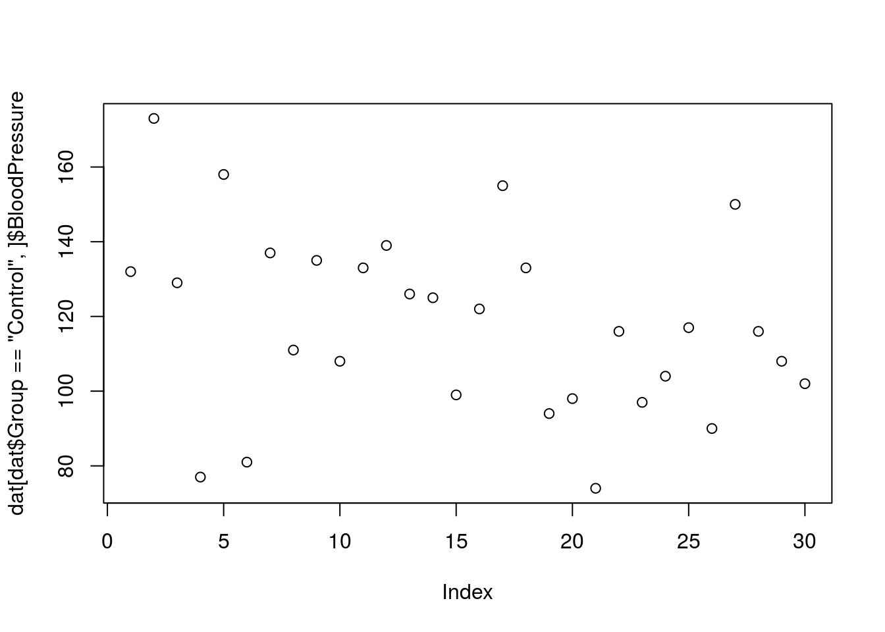

> **Using Logical Indexes**
>
> 1. Create a scatterplot showing BloodPressure for subjects not in the control group.
> 2. How many ways are there to index this set of subjects?
{: .challenge}

### Combining Indexing and Assignment

The assignment operator `<-` can be combined with indexing.


```r
x <- c(1, 2, 3, 11, 12, 13)
x[x < 10] <- 0
x
```

```
## [1]  0  0  0 11 12 13
```

> **Updating a Subset of Values**
>
> In this dataset, values for Gender have been recorded as both uppercase `M, F` and lowercase `m,f`.
> Combine the indexing and assignment operations to convert all values to lowercase.
{: .challenge}

## R Data Structures

### Understanding Basic Data Types in R

To make the best of the R language, you'll need a strong understanding of the
basic data types and data structures and how to operate on those.

Very important to understand because these are the objects you will manipulate
on a day-to-day basis in R. Dealing with object conversions is one of the most
common sources of frustration for beginners.

**Everything** in R is an object.

R has 6 (although we will not discuss the raw class for this workshop) atomic
vector types.

* character
* numeric (real or decimal)
* integer
* logical
* complex

By *atomic*, we mean the vector only holds data of a single type.

* **character**: `"a"`, `"swc"`
* **numeric**: `2`, `15.5`
* **integer**: `2L` (the `L` tells R to store this as an integer)
* **logical**: `TRUE`, `FALSE`
* **complex**: `1+4i` (complex numbers with real and imaginary parts)

R provides many functions to examine features of vectors and other objects, for
example

* `class()` - what kind of object is it (high-level)?
* `typeof()` - what is the object's data type (low-level)?
* `length()` - how long is it? What about two dimensional objects?
* `attributes()` - does it have any metadata?


```r
# Example
x <- "dataset"
typeof(x)
```

```
## [1] "character"
```

```r
attributes(x)
```

```
## NULL
```

```r
y <- 1:10
y
```

```
##  [1]  1  2  3  4  5  6  7  8  9 10
```

```r
typeof(y)
```

```
## [1] "integer"
```

```r
length(y)
```

```
## [1] 10
```

```r
z <- as.numeric(y)
z
```

```
##  [1]  1  2  3  4  5  6  7  8  9 10
```

```r
typeof(z)
```

```
## [1] "double"
```

R has many __data structures__. These include

* atomic vector
* list
* matrix
* data frame
* factors

### Atomic Vectors

A vector is the most common and basic data structure in R and is pretty much the
workhorse of R. Technically, vectors can be one of two types:

* atomic vectors
* lists

although the term "vector" most commonly refers to the atomic types not to lists.

### The Different Vector Modes

A vector is a collection of elements that are most commonly of mode `character`,
`logical`, `integer` or `numeric`.

You can create an empty vector with `vector()`. (By default the mode is
`logical`. You can be more explicit as shown in the examples below.) It is more
common to use direct constructors such as `character()`, `numeric()`, etc.


```r
vector() # an empty 'logical' (the default) vector
```

```
## logical(0)
```

```r
vector("character", length = 5) # a vector of mode 'character' with 5 elements
```

```
## [1] "" "" "" "" ""
```

```r
character(5) # the same thing, but using the constructor directly
```

```
## [1] "" "" "" "" ""
```

```r
numeric(5)   # a numeric vector with 5 elements
```

```
## [1] 0 0 0 0 0
```

```r
logical(5)   # a logical vector with 5 elements
```

```
## [1] FALSE FALSE FALSE FALSE FALSE
```

You can also create vectors by directly specifying their content. R will then
guess the appropriate mode of storage for the vector. For instance:


```r
x <- c(1, 2, 3)
```

will create a vector `x` of mode `numeric`. These are the most common kind, and
are treated as double precision real numbers. If you wanted to explicitly create
integers, you need to add an `L` to each element (or *coerce* to the integer
type using `as.integer()`).


```r
x1 <- c(1L, 2L, 3L)
```

Using `TRUE` and `FALSE` will create a vector of mode `logical`:


```r
y <- c(TRUE, TRUE, FALSE, FALSE)
```

While using quoted text will create a vector of mode `character`:


```r
z <- c("Sarah", "Tracy", "Jon")
```

### Examining Vectors

The functions `typeof()`, `length()`, `class()` and `str()` provide useful
information about your vectors and R objects in general.


```r
typeof(z)
```

```
## [1] "character"
```

```r
length(z)
```

```
## [1] 3
```

```r
class(z)
```

```
## [1] "character"
```

```r
str(z)
```

```
##  chr [1:3] "Sarah" "Tracy" "Jon"
```

> **Finding Commonalities**
>
> Do you see a property that's common to all these vectors above?
{: .challenge}

### Adding Elements

The function `c()` (for combine) can also be used to add elements to a vector.


```r
z <- c(z, "Annette")
z
```

```
## [1] "Sarah"   "Tracy"   "Jon"     "Annette"
```

```r
z <- c("Greg", z)
z
```

```
## [1] "Greg"    "Sarah"   "Tracy"   "Jon"     "Annette"
```

### Vectors from a Sequence of Numbers

You can create vectors as a sequence of numbers.


```r
series <- 1:10
seq(10)
```

```
##  [1]  1  2  3  4  5  6  7  8  9 10
```

```r
seq(from = 1, to = 10, by = 0.1)
```

```
##  [1]  1.0  1.1  1.2  1.3  1.4  1.5  1.6  1.7  1.8  1.9  2.0  2.1  2.2  2.3
## [15]  2.4  2.5  2.6  2.7  2.8  2.9  3.0  3.1  3.2  3.3  3.4  3.5  3.6  3.7
## [29]  3.8  3.9  4.0  4.1  4.2  4.3  4.4  4.5  4.6  4.7  4.8  4.9  5.0  5.1
## [43]  5.2  5.3  5.4  5.5  5.6  5.7  5.8  5.9  6.0  6.1  6.2  6.3  6.4  6.5
## [57]  6.6  6.7  6.8  6.9  7.0  7.1  7.2  7.3  7.4  7.5  7.6  7.7  7.8  7.9
## [71]  8.0  8.1  8.2  8.3  8.4  8.5  8.6  8.7  8.8  8.9  9.0  9.1  9.2  9.3
## [85]  9.4  9.5  9.6  9.7  9.8  9.9 10.0
```

### Missing Data

R supports missing data in vectors. They are represented as `NA` (Not Available)
and can be used for all the vector types covered in this lesson:


```r
x <- c(0.5, NA, 0.7)
x <- c(TRUE, FALSE, NA)
x <- c("a", NA, "c", "d", "e")
x <- c(1+5i, 2-3i, NA)
```

The function `is.na()` indicates the elements of the vectors that represent
missing data, and the function `anyNA()` returns `TRUE` if the vector contains
any missing values:


```r
x <- c("a", NA, "c", "d", NA)
y <- c("a", "b", "c", "d", "e")
is.na(x)
```

```
## [1] FALSE  TRUE FALSE FALSE  TRUE
```

```r
is.na(y)
```

```
## [1] FALSE FALSE FALSE FALSE FALSE
```

```r
anyNA(x)
```

```
## [1] TRUE
```

```r
anyNA(y)
```

```
## [1] FALSE
```

### Other Special Values

`Inf` is infinity. You can have either positive or negative infinity.


```r
1/0
```

```
## [1] Inf
```

`NaN` means Not a Number. It's an undefined value.


```r
0/0
```

```
## [1] NaN
```

### What Happens When You Mix Types Inside a Vector?

R will create a resulting vector with a mode that can most easily accommodate
all the elements it contains. This conversion between modes of storage is called
"coercion". When R converts the mode of storage based on its content, it is
referred to as "implicit coercion". For instance, can you guess what the
following do (without running them first)?


```r
xx <- c(1.7, "a")
xx <- c(TRUE, 2)
xx <- c("a", TRUE)
```

You can also control how vectors are coerced explicitly using the
`as.<class_name>()` functions:


```r
as.numeric("1")
```

```
## [1] 1
```

```r
as.character(1:2)
```

```
## [1] "1" "2"
```

### Objects Attributes

Objects can have __attributes__. Attributes are part of the object. These include:

* names
* dimnames
* dim
* class
* attributes (contain metadata)

You can also glean other attribute-like information such as length (works on
vectors and lists) or number of characters (for character strings).


```r
length(1:10)
```

```
## [1] 10
```

```r
nchar("Software Carpentry")
```

```
## [1] 18
```

### Matrix

In R matrices are an extension of the numeric or character vectors. They are not
a separate type of object but simply an atomic vector with dimensions; the
number of rows and columns.


```r
m <- matrix(nrow = 2, ncol = 2)
m
```

```
##      [,1] [,2]
## [1,]   NA   NA
## [2,]   NA   NA
```

```r
dim(m)
```

```
## [1] 2 2
```

Matrices in R are filled column-wise.


```r
m <- matrix(1:6, nrow = 2, ncol = 3)
```

Other ways to construct a matrix


```r
m      <- 1:10
dim(m) <- c(2, 5)
```

This takes a vector and transforms it into a matrix with 2 rows and 5 columns.

Another way is to bind columns or rows using `cbind()` and `rbind()`.


```r
x <- 1:3
y <- 10:12
cbind(x, y)
```

```
##      x  y
## [1,] 1 10
## [2,] 2 11
## [3,] 3 12
```

```r
rbind(x, y)
```

```
##   [,1] [,2] [,3]
## x    1    2    3
## y   10   11   12
```

You can also use the `byrow` argument to specify how the matrix is filled. From R's own documentation:


```r
mdat <- matrix(c(1,2,3, 11,12,13), nrow = 2, ncol = 3, byrow = TRUE)
mdat
```

```
##      [,1] [,2] [,3]
## [1,]    1    2    3
## [2,]   11   12   13
```

### List

In R lists act as containers. Unlike atomic vectors, the contents of a list are
not restricted to a single mode and can encompass any mixture of data
types. Lists are sometimes called generic vectors, because the elements of a
list can by of any type of R object, even lists containing further lists. This
property makes them fundamentally different from atomic vectors.

A list is a special type of vector. Each element can be a different type.

Create lists using `list()` or coerce other objects using `as.list()`. An empty
list of the required length can be created using `vector()`


```r
x <- list(1, "a", TRUE, 1+4i)
x
```

```
## [[1]]
## [1] 1
## 
## [[2]]
## [1] "a"
## 
## [[3]]
## [1] TRUE
## 
## [[4]]
## [1] 1+4i
```

```r
x <- vector("list", length = 5) ## empty list
length(x)
```

```
## [1] 5
```

```r
x[[1]]
```

```
## NULL
```

```r
x <- 1:10
x <- as.list(x)
length(x)
```

```
## [1] 10
```

1. What is the class of `x[1]`?
2. What about `x[[1]]`?


```r
xlist <- list(a = "Karthik Ram", b = 1:10, data = head(iris))
xlist
```

```
## $a
## [1] "Karthik Ram"
## 
## $b
##  [1]  1  2  3  4  5  6  7  8  9 10
## 
## $data
##   Sepal.Length Sepal.Width Petal.Length Petal.Width Species
## 1          5.1         3.5          1.4         0.2  setosa
## 2          4.9         3.0          1.4         0.2  setosa
## 3          4.7         3.2          1.3         0.2  setosa
## 4          4.6         3.1          1.5         0.2  setosa
## 5          5.0         3.6          1.4         0.2  setosa
## 6          5.4         3.9          1.7         0.4  setosa
```

1. What is the length of this object? What about its structure?

Lists can be extremely useful inside functions. You can “staple” together lots
of different kinds of results into a single object that a function can return.

A list does not print to the console like a vector. Instead, each element of the
list starts on a new line.

Elements are indexed by double brackets. Single brackets will still return
a(nother) list.


### Data Frame

A data frame is a very important data type in R. It's pretty much the *de facto*
data structure for most tabular data and what we use for statistics.

A data frame is a special type of list where every element of the list has same length.

Data frames can have additional attributes such as `rownames()`, which can be
useful for annotating data, like `subject_id` or `sample_id`. But most of the
time they are not used.

Some additional information on data frames:

* Usually created by `read.csv()` and `read.table()`.
* Can convert to matrix with `data.matrix()` (preferred) or `as.matrix()`
* Coercion will be forced and not always what you expect.
* Can also create with `data.frame()` function.
* Find the number of rows and columns with `nrow(dat)` and `ncol(dat)`, respectively.
* Rownames are usually 1, 2, ..., n.

### Creating Data Frames by Hand

To create data frames by hand:


```r
dat <- data.frame(id = letters[1:10], x = 1:10, y = 11:20)
dat
```

```
##    id  x  y
## 1   a  1 11
## 2   b  2 12
## 3   c  3 13
## 4   d  4 14
## 5   e  5 15
## 6   f  6 16
## 7   g  7 17
## 8   h  8 18
## 9   i  9 19
## 10  j 10 20
```

> **Useful Data Frame Functions**
>
> * `head()` - shown first 6 rows
> * `tail()` - show last 6 rows
> * `dim()` - returns the dimensions
> * `nrow()` - number of rows
> * `ncol()` - number of columns
> * `str()` - structure of each column
> * `names()` - shows the `names` attribute for a data frame, which gives the column names.
{: .callout}

See that it is actually a special list:


```r
is.list(iris)
```

```
## [1] TRUE
```

```r
class(iris)
```

```
## [1] "data.frame"
```

| Dimensions | Homogenous | Heterogeneous |
| ------- | ---- | ---- |
| 1-D | atomic vector | list |
| 2-D | matrix | data frame |


> **Column Types in Data Frames**
>
> Knowing that data frames are lists of lists, can columns be of different type?
>
> What type of structure do you expect on the iris data frame? Hint: Use `str()`.
>
> ~~~
> # The Sepal.Length, Sepal.Width, Petal.Length and Petal.Width columns are all
> # numeric types, while Species is a Factor.
> # Lists can have elements of different types.
> # Since a Data Frame is just a special type of list, it can have columns of
> # differing type (although, remember that type must be consistent within each column!).
> str(iris)
> ~~~
> {: .r}
{: .challenge}

## Understanding Factors

Factors are used to represent categorical data. Factors can be ordered or
unordered and are an important class for statistical analysis and for plotting.

Factors are stored as integers, and have labels associated with these unique
integers. While factors look (and often behave) like character vectors, they are
actually integers under the hood, and you need to be careful when treating them
like strings.

Once created, factors can only contain a pre-defined set values, known as
*levels*. By default, R always sorts *levels* in alphabetical order. For
instance, if you have a factor with 2 levels:

> **The `factor()` Command**
>
> The `factor()` command is used to create and modify factors in R:
>
> 
> ```r
> sex <- factor(c("male", "female", "female", "male"))
> ```
{: .callout}

R will assign `1` to the level `"female"` and `2` to the level `"male"` (because
`f` comes before `m`, even though the first element in this vector is
`"male"`). You can check this by using the function `levels()`, and check the
number of levels using `nlevels()`:


```r
levels(sex)
```

```
## [1] "female" "male"
```

```r
nlevels(sex)
```

```
## [1] 2
```

Sometimes, the order of the factors does not matter, other times you might want
to specify the order because it is meaningful (e.g., "low", "medium", "high") or
it is required by particular type of analysis. Additionally, specifying the
order of the levels allows us to compare levels:


```r
food <- factor(c("low", "high", "medium", "high", "low", "medium", "high"))
levels(food)
```

```
## [1] "high"   "low"    "medium"
```

```r
food <- factor(food, levels = c("low", "medium", "high"))
levels(food)
```

```
## [1] "low"    "medium" "high"
```

```r
min(food) ## doesn't work
```

```
## Error in Summary.factor(structure(c(1L, 3L, 2L, 3L, 1L, 2L, 3L), .Label = c("low", : 'min' not meaningful for factors
```

```r
food <- factor(food, levels = c("low", "medium", "high"), ordered=TRUE)
levels(food)
```

```
## [1] "low"    "medium" "high"
```

```r
min(food) ## works!
```

```
## [1] low
## Levels: low < medium < high
```

In R's memory, these factors are represented by numbers (1, 2, 3). They are
better than using simple integer labels because factors are self describing:
`"low"`, `"medium"`, and `"high"`" is more descriptive than `1`, `2`, `3`. Which
is low?  You wouldn't be able to tell with just integer data. Factors have this
information built in. It is particularly helpful when there are many levels
(like the subjects in our example data set).

> **Representing Data in R**
>
> You have a vector representing levels of exercise undertaken by 5 subjects
>
> **"l","n","n","i","l"** ; n=none, l=light, i=intense
>
> What is the best way to represent this in R?
>
> a) exercise <- c("l", "n", "n", "i", "l")
>
> b) exercise <- factor(c("l", "n", "n", "i", "l"), ordered = TRUE)
>
> c) exercise < -factor(c("l", "n", "n", "i", "l"), levels = c("n", "l", "i"), ordered = FALSE)
>
> d) exercise <- factor(c("l", "n", "n", "i", "l"), levels = c("n", "l", "i"), ordered = TRUE)
{: .challenge}

###  Converting Factors

Converting from a factor to a number can cause problems:


```r
f <- factor(c(3.4, 1.2, 5))
as.numeric(f)
```

```
## [1] 2 1 3
```

This does not behave as expected (and there is no warning).

The recommended way is to use the integer vector to index the factor levels:


```r
levels(f)[f]
```

```
## [1] "3.4" "1.2" "5"
```

This returns a character vector, the `as.numeric()` function is still required to convert the values to the proper type (numeric).


```r
f <- levels(f)[f]
f <- as.numeric(f)
```

### Using Factors

Lets load our example data to see the use of factors:


```r
dat <- read.csv(file = 'data/sample.csv', stringsAsFactors = TRUE)
```

> **Default Behavior**
>
> `stringsAsFactors=TRUE` is the default behavior for R.
> We could leave this argument out.
> It is included here for clarity.
{: .callout}


```r
str(dat)
```

```
## 'data.frame':	100 obs. of  9 variables:
##  $ ID           : Factor w/ 100 levels "Sub001","Sub002",..: 1 2 3 4 5 6 7 8 9 10 ...
##  $ Gender       : Factor w/ 4 levels "f","F","m","M": 3 3 3 1 3 4 1 3 3 1 ...
##  $ Group        : Factor w/ 3 levels "Control","Treatment1",..: 1 3 3 2 2 3 1 3 3 1 ...
##  $ BloodPressure: int  132 139 130 105 125 112 173 108 131 129 ...
##  $ Age          : num  16 17.2 19.5 15.7 19.9 14.3 17.7 19.8 19.4 18.8 ...
##  $ Aneurisms_q1 : int  114 148 196 199 188 260 135 216 117 188 ...
##  $ Aneurisms_q2 : int  140 209 251 140 120 266 98 238 215 144 ...
##  $ Aneurisms_q3 : int  202 248 122 233 222 320 154 279 181 192 ...
##  $ Aneurisms_q4 : int  237 248 177 220 228 294 245 251 272 185 ...
```

Notice the first 3 columns have been converted to factors. These values were text in the data file so R automatically interpreted them as categorical variables.


```r
summary(dat)
```

```
##        ID     Gender        Group    BloodPressure        Age       
##  Sub001 : 1   f:35   Control   :30   Min.   : 62.0   Min.   :12.10  
##  Sub002 : 1   F: 4   Treatment1:35   1st Qu.:107.5   1st Qu.:14.78  
##  Sub003 : 1   m:46   Treatment2:35   Median :117.5   Median :16.65  
##  Sub004 : 1   M:15                   Mean   :118.6   Mean   :16.42  
##  Sub005 : 1                          3rd Qu.:133.0   3rd Qu.:18.30  
##  Sub006 : 1                          Max.   :173.0   Max.   :20.00  
##  (Other):94                                                         
##   Aneurisms_q1    Aneurisms_q2    Aneurisms_q3    Aneurisms_q4  
##  Min.   : 65.0   Min.   : 80.0   Min.   :105.0   Min.   :116.0  
##  1st Qu.:118.0   1st Qu.:131.5   1st Qu.:182.5   1st Qu.:186.8  
##  Median :158.0   Median :162.5   Median :217.0   Median :219.0  
##  Mean   :158.8   Mean   :168.0   Mean   :219.8   Mean   :217.9  
##  3rd Qu.:188.0   3rd Qu.:196.8   3rd Qu.:248.2   3rd Qu.:244.2  
##  Max.   :260.0   Max.   :283.0   Max.   :323.0   Max.   :315.0  
## 
```

Notice the `summary()` function handles factors differently to numbers (and strings), the occurrence counts for each value is often more useful information.

> **The `summary()` Function**
>
> The `summary()` function is a great way of spotting errors in your data (look at the *dat$Gender* column).
> It's also a great way for spotting missing data.
{: .callout}

> **Reordering Factors**
>
> The function `table()` tabulates observations and can be used to create bar plots quickly. For instance:
>
> 
> ```r
> table(dat$Group)
> ```
> 
> ```
> ## 
> ##    Control Treatment1 Treatment2 
> ##         30         35         35
> ```
> 
> ```r
> barplot(table(dat$Group))
> ```
> 
> 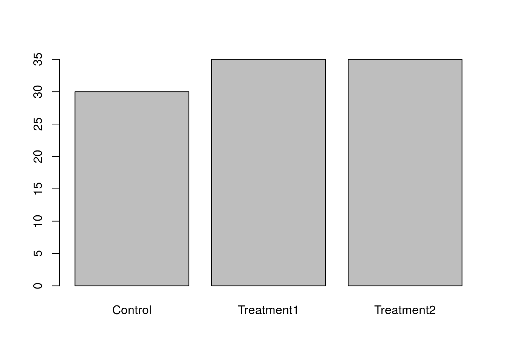
> Use the `factor()` command to modify the column dat$Group so that the *control* group is plotted last
{: .challenge}

### Removing Levels from a Factor

Some of the Gender values in our dataset have been coded incorrectly.
Let's remove factors.


```r
barplot(table(dat$Gender))
```

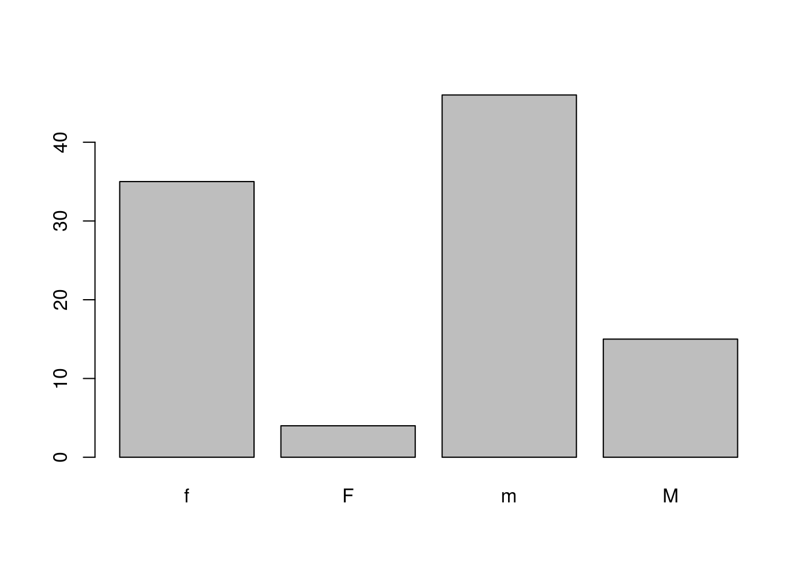

Values should have been recorded as lowercase 'm' & 'f'. We should correct this.


```r
dat$Gender[dat$Gender == 'M'] <- 'm'
```

> **Updating Factors**
>
> 
> ```r
> plot(x = dat$Gender, y = dat$BloodPressure)
> ```
> 
> 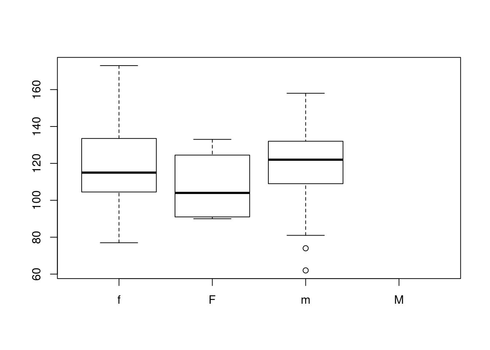
>
> Why does this plot show 4 levels?
>
> *Hint* how many levels does dat$Gender have?
{: .challenge}

We need to tell R that "M" is no longer a valid value for this column.
We use the `droplevels()` function to remove extra levels.


```r
dat$Gender <- droplevels(dat$Gender)
plot(x = dat$Gender, y = dat$BloodPressure)
```


> **Adjusting Factor Levels**
>
> Adjusting the `levels()` of a factor provides a useful shortcut for reassigning values in this case.
>
> 
> ```r
> levels(dat$Gender)[2] <- 'f'
> plot(x = dat$Gender, y = dat$BloodPressure)
> ```
> 
> 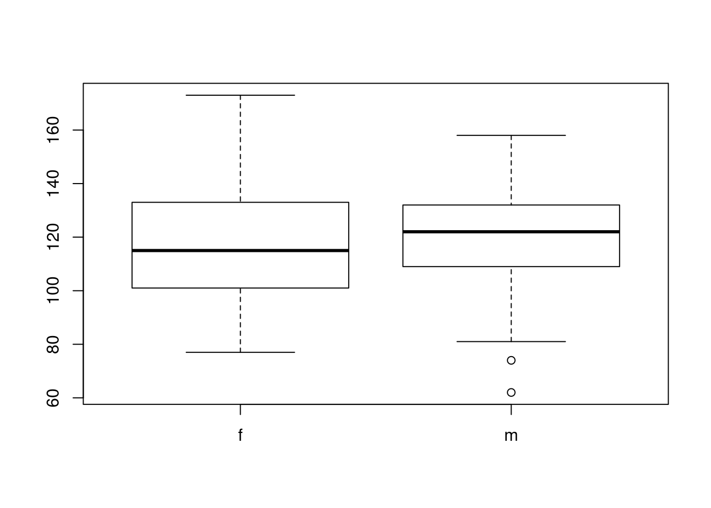
{: .callout}


## Learning more

1. Interactive course [Introduction to R](https://www.datacamp.com/courses/free-introduction-to-r) by Data Camp covers the R basics, vectors, matrices, factors and data frame.
2. Interactive course [Intermediate R](https://www.datacamp.com/courses/free-introduction-to-r) by Data Camp covers Conditionals, Control Flow, loops, functions, and utility functions.
3. [Google's R Style Guide](https://google.github.io/styleguide/Rguide.xml) lists Google's coding rules for R to make code easier to read, share, and verify.
4. Hadley Wickham's [Style Guide](http://adv-r.had.co.nz/Style.html) in his Advanced R book.
